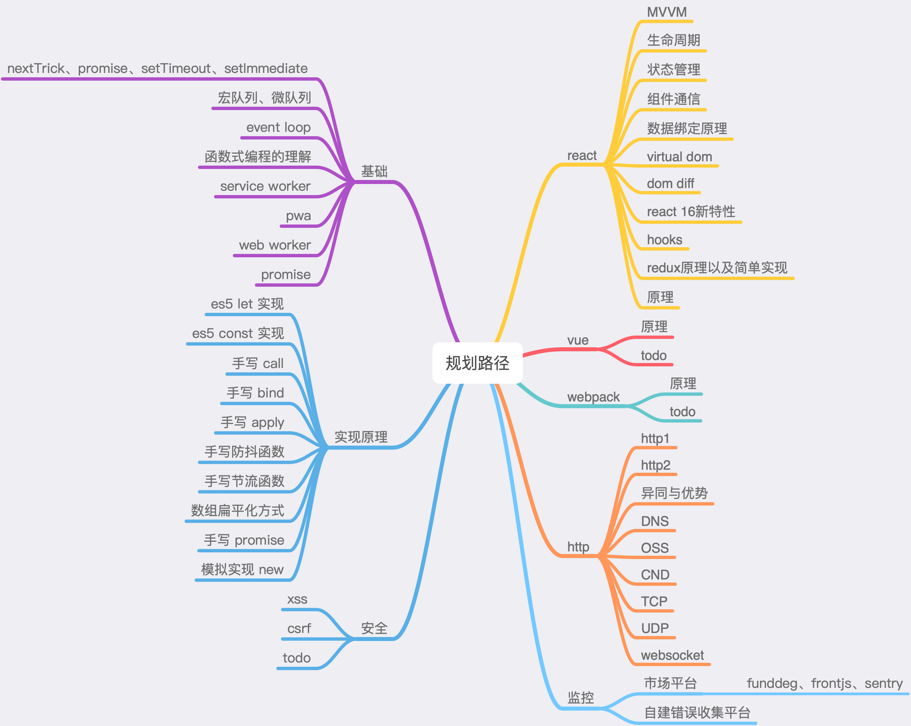

## 面经宝典 :id=start

> 颗粒化细节，知识点面面俱到，再也不惧面试

## 学习路径

## 基础篇
- [必知必会之Promise](./src/basis/Promise.md)
- [必知必会之基础篇](./src/interview/必知必会之基础篇.md)
- [必知必会之高级篇](./src/interview/必知必会之高级篇.md)
- [必知必会之编码篇](./src/interview/必知必会之编码篇.md)

## 算法篇
- [LeetCode](./src/arithmetic/index.md)

?> _TODO_ 待补充
