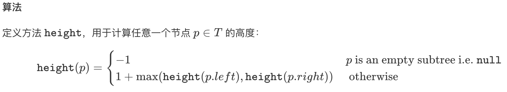

## 平衡二叉树

### 题目
```javascript
//给定一个二叉树，判断它是否是高度平衡的二叉树。
//
// 本题中，一棵高度平衡二叉树定义为：
//
//
// 一个二叉树每个节点 的左右两个子树的高度差的绝对值不超过1。
//
//
// 示例 1:
//
// 给定二叉树 [3,9,20,null,null,15,7]
//
//     3
//   / \
//  9  20
//    /  \
//   15   7
//
// 返回 true 。
//
//示例 2:
//
// 给定二叉树 [1,2,2,3,3,null,null,4,4]
//
//        1
//      / \
//     2   2
//    / \
//   3   3
//  / \
// 4   4
//
//
// 返回 false 。
//
//
// Related Topics 树 深度优先搜索


//leetcode submit region begin(Prohibit modification and deletion)
/**
 * Definition for a binary tree node.
 * function TreeNode(val) {
 *     this.val = val;
 *     this.left = this.right = null;
 * }
 */
/**
 * @param {TreeNode} root
 * @return {boolean}
 */
var isBalanced = function (root) {
  
};
//leetcode submit region end(Prohibit modification and deletion)
```

### 思路
- 计算每个节点高度

```javascript
var getRootHeight = function (node) {
  if (node === null) return -1;

  return 1 + Math.max(getRootHeight(node.left), getRootHeight(node.right));
}
```

- 对比左右节点高度差
```javascript
var isBalanced = function (root) {
  if (root == null) {
    return true;
  } else if (Math.abs(getRootHeight(root.left) - getRootHeight(root.right)) > 1) {
    return false;
  } else {
    return isBalanced(root.left) && isBalanced(root.right);
  }
};
```

### 复杂度分析

- 时间复杂度：`O(n)`，计算每棵子树的高度和判断平衡操作都在恒定时间内完成。
- 空间复杂度：`O(n)`，如果树不平衡，递归栈可能达到 `O(n)`。
