### ES11新特性（2020发布）

> ECMAScript 语言规范的第 11 版本。

#### String.prototype.matchAll(regexp)

> `matchAll`方法返回一个包含所有匹配正则表达式的结果及分组捕获组的迭代器。
>
> 入参：`regexp`为正则表达式对象。如果所传参数不是一个正则表达式对象，则会隐式地使用 `new RegExp(obj)` 将其转换为一个 [`RegExp`](https://developer.mozilla.org/zh-CN/docs/Web/JavaScript/Reference/RegExp) 。
>
> 返回：一个迭代器（不可重用，结果耗尽需要再次调用方法，获取一个新的迭代器）。

- 基本使用

```javascript
const regexp = /t(e)(st(\d?))/g;
const str = "test1test2";

// 返回迭代器
const iterator = str.matchAll(regexp);
const array = [...iterator];

console.log(array[0]);
// expected output: Array ["test1", "e", "st1", "1"]

console.log(array[1]);
// expected output: Array ["test2", "e", "st2", "2"]
```

- 控制台执行

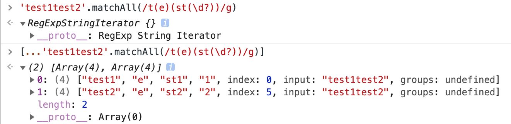

- 注意事项：`matchAll`入参`regexp`必须跟上`g`按全文查找，否则会抛出`TypeError`异常

  - `/i` ：忽略大小写

  - `/g` ：全文查找出现的所有匹配字符

  - `/m` ：多行查找

  - `/ig`：全文查找、忽略大小写

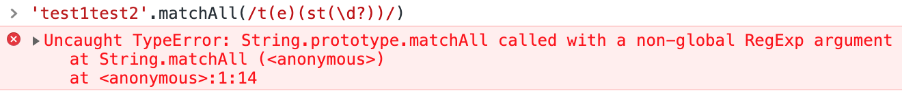

- 兼容性


#### Dynamic import 动态引入

> 标准用法的`import`导入的模块是静态的，会使所有被导入的模块，在加载时就被编译（无法做到按需编译，降低首页加载速度）。
>
> 有些场景中，你可能希望根据条件导入模块或者按需导入模块，这时你可以使用动态导入代替静态导入。下面的是你可能会需要动态导入的场景：

- 使用场景

  - 当静态导入的模块很明显的降低了代码的加载速度且被使用的可能性很低，或者并不需要马上使用它。
  - 当静态导入的模块很明显的占用了大量系统内存且被使用的可能性很低。
  - 当被导入的模块，在加载时并不存在，需要异步获取
  - 当导入模块的说明符，需要动态构建。（静态导入只能使用静态说明符）
  - 当被导入的模块有副作用（这里说的副作用，可以理解为模块中会直接运行的代码），这些副作用只有在触发了某些条件才被需要时。（原则上来说，模块不能有副作用，但是很多时候，你无法控制你所依赖的模块的内容）

- 常规用作异步按需加载

```javascript
function callback() {
  // 同样支持 await 写法
  import("moduleB")
    .then((module) => {
      // todo
    })
    .catch((err) => {
      // load error
    });
}
```

- 兼容性


#### import.meta

> `import.meta`是一个给 JavaScript 模块暴露特定上下文的元数据属性的对象。它包含了这个模块的信息，比如说这个模块的 URL。

- 基本使用

  - 通过`script`标签引用

  ```javascript
  <script type="module" src="my-module.mjs"></script>;

  // 在 my-module.mjs 中使用
  console.log(import.meta); // { url: "file:///home/user/my-module.mjs" }
  ```

  - 通过 `import`引用

  ```javascript
  // a.js
  import "b.js?param1=test";

  // b.js
  import.meta.url; // ...b.js?param1=test
  ```

- 兼容性


#### export * as alias from namespace

> 模块重定向

- 基本使用

```javascript
// 如果我们想要在当前模块中，导出指定导入模块的默认导出（等于是创建了一个“重定向”）：
// module "redirect-module.js"
export {default} from './other-module';
export * from './other-module';
export * as otherName from './other-module';
```

- 兼容性

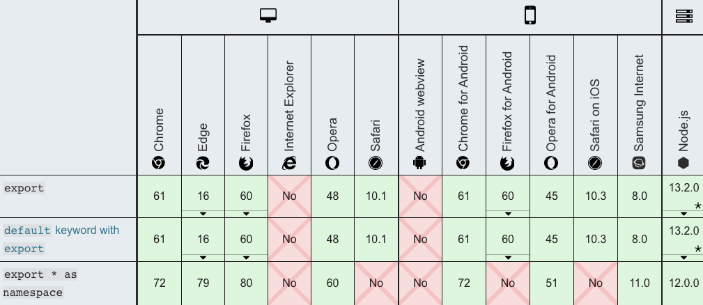

#### Promise.allSettled(iterable)

> 入参：一个可迭代的对象，其中每个成员都是 `Promise`
>
> 返回：一个在所有给定的`promise`都已经`fulfilled`或`rejected`后的`promise`，并带有一个对象数组，每个对象表示对应的`promise`结果。
>
> 当您有多个彼此不依赖的异步任务成功完成时，或者您总是想知道每个`promise`的结果时，通常使用它。
>
> 相比之下，`Promise.all()` 更适合彼此相互依赖或者在其中任何一个`reject`时立即结束。

- 基本使用

```javascript
const promise1 = Promise.resolve(3);
const promise2 = new Promise((resolve, reject) =>
  setTimeout(reject, 100, "foo")
);
const promises = [promise1, promise2];

Promise.allSettled(promises).then((results) =>
  results.forEach((result) => console.log(result.status))
);

// Promise {<pending>}
// fulfilled
// rejected
```

- 兼容性


#### BigInt

> 最新的 ECMAScript 标准定义了 8 种数据类型：7 中原始类型：Boolean、Null、Undefined、Number、BigInt、String、Symbol；和 Object；
>
> [`BigInt`](https://developer.mozilla.org/zh-CN/docs/Web/JavaScript/Reference/Global_Objects/BigInt)类型是 JavaScript 中的一个基础的数值类型，可以用任意精度表示整数。使用 BigInt，您可以安全地存储和操作大整数，甚至可以超过数字的安全整数限制。
>
> **BigInt** 是一种内置对象，它提供了一种方法来表示大于 `2^53 - 1` 的整数。这原本是 Javascript 中可以用 [`Number`](https://developer.mozilla.org/zh-CN/docs/Web/JavaScript/Reference/Global_Objects/Number) 表示的最大数字。**BigInt** 可以表示任意大的整数。
>
> `BigInt`是通过在整数末尾附加 `n `或调用构造函数来创建的。
>
> 通过使用常量[`Number.MAX_SAFE_INTEGER`](https://developer.mozilla.org/zh-CN/docs/Web/JavaScript/Reference/Global_Objects/Number/MAX_SAFE_INTEGER)(2^53 - 1)，您可以获得可以用数字递增的最安全的值。通过引入 BigInt，您可以操作超过[`Number.MAX_SAFE_INTEGER`](https://developer.mozilla.org/zh-CN/docs/Web/JavaScript/Reference/Global_Objects/Number/MAX_SAFE_INTEGER)的数字。
>
> 可以对`BigInt`使用运算符` +、``*、``-、``** `和`%`，就像对数字一样。BigInt 严格来说并不等于一个数字，但它是松散的。

- 基本使用

```javascript
const x = 2n ** 53n;
// ↪ 9007199254740992n
const y = x + 1n;
// ↪ 9007199254740993n
const previousMaxSafe = BigInt(Number.MAX_SAFE_INTEGER);
// ↪ 9007199254740991n
const maxPlusOne = previousMaxSafe + 1n;
// ↪ 9007199254740992n
const theFuture = previousMaxSafe + 2n;
// ↪ 9007199254740993n, this works now!
const multi = previousMaxSafe * 2n;
// ↪ 18014398509481982n
const subtr = multi – 10n;
// ↪ 18014398509481972n
const mod = multi % 10n;
// ↪ 2n
const bigN = 2n ** 54n;
// ↪ 18014398509481984n
bigN * -1n
// ↪ –18014398509481984n
```

- 在将`BigInt`转换为`Boolean`时，它的行为类似于一个数字：` if、``||、``&&、``Boolean 和``!。 `

```javascript
0n === 0;
// ↪ false
0n == 0;
// ↪ true
```

- `BigInt`不能与数字互换操作。否则，将抛出`TypeError`。

```javascript
1 + 1n; // Uncaught TypeError: Cannot mix BigInt and other types, use explicit conversions
```

- 当使用 `BigInt` 时，带小数的运算会被取整。

```javascript
const expected = 4n / 2n;
// ↪ 2n
const rounded = 5n / 2n;
// ↪ 2n, not 2.5n
```

- Number 和 BigInt 可以进行比较

```javascript
1n == 1;
// ↪ true
1n === 1;
// ↪ false
1n < 2;
// ↪ true
2n > 1;
// ↪ true
2 > 2;
// ↪ false
2n > 2;
// ↪ false
2n >= 2;
// ↪ true

// 两者也可以混在一起进行比较
const mixed = [4n, 6, -12n, 10, 4, 0, 0n];
// ↪  [4n, 6, -12n, 10, 4, 0, 0n]
mixed.sort();
// ↪ [-12n, 0, 0n, 10, 4n, 4, 6]

// 注意被 Object 包装的 BigInts 使用 object 的比较规则进行比较，只用同一个对象在比较时才会相等。
0n === Object(0n); // false
Object(0n) === Object(0n); // false
0n === 0n; // true
const o = Object(0n);
o === o; // true
```

- 兼容性

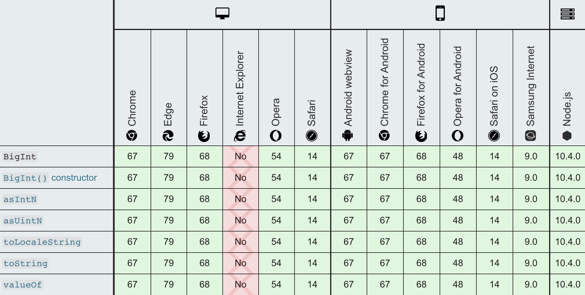

#### globalThis

> 全局属性 `globalThis` 包含全局的 `this` 值，类似于全局对象（global object）。

- 之前不同环境下

  - `web`中：可以通过 `window`、`self` 或者 `frames` 取到全局对象
  - `Web Workers`中：只有`self`可以
  - `Node.js`中：必须使用`global`
  - 在松散模式下，可以通过`this`来获取全局对象
  - 在严格模式下，`this`会返回`undefined`，可以通过`function(){return this}`

- `globalThis`提供了一个标准的方式来获取不同环境下的全局`this`对象（全局对象自身）

  > 不像 `window` 或者 `self` 这些属性，它确保可以在有无窗口的各种环境下正常工作。所以，你可以安心的使用 `globalThis`，不必担心它的运行环境。为便于记忆，你只需要记住，全局作用域中的 `this` 就是 `globalThis`。

- HTML 与 WindowProxy

  > 在很多引擎中， `globalThis` 被认为是真实的全局对象的引用，但是在浏览器中，由于 iframe 以及跨窗口安全性的考虑，它实际引用的是真实全局对象（不可以被直接访问）的 [`Proxy`](https://developer.mozilla.org/zh-CN/docs/Web/JavaScript/Reference/Global_Objects/Proxy) 代理。在通常的应用中，很少会涉及到代理与对象本身的区别，但是也需要加以注意。

- 基本使用

```javascript
// 没有 globalThis 之前获取全局对象的统一方式
var getGlobal = function () {
  if (typeof self !== "undefined") {
    return self;
  }
  if (typeof window !== "undefined") {
    return window;
  }
  if (typeof global !== "undefined") {
    return global;
  }
  throw new Error("unable to locate global object");
};

var globals = getGlobal();

if (typeof globals.setTimeout !== "function") {
  // 此环境中没有 setTimeout 方法！
}

// 有了 globalThis 之后，只需
if (typeof globalThis.setTimeout !== "function") {
  //  此环境中没有 setTimeout 方法！
}
```

- 兼容性

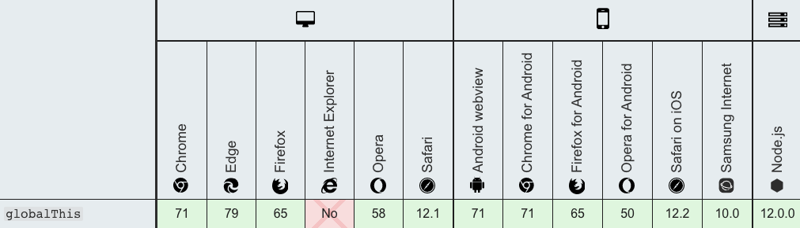

#### [Optional chaining (?.)](https://developer.mozilla.org/zh-CN/docs/Web/JavaScript/Reference/Operators/Optional_chaining)

> **可选链**操作符( **`?.`** )允许读取位于连接对象链深处的属性的值，而不必明确验证链中的每个引用是否有效。`?.` 操作符的功能类似于 `.` 链式操作符，不同之处在于，在引用为空([`null`](https://developer.mozilla.org/zh-CN/docs/Web/JavaScript/Reference/Global_Objects/null) 或者 [`undefined`](https://developer.mozilla.org/zh-CN/docs/Web/JavaScript/Reference/Global_Objects/undefined)) 的情况下不会引起错误，该表达式短路返回值是 `undefined`。
>
> 与函数调用一起使用时，如果给定的函数不存在，则返回 `undefined`。

- 语法

```javascript
obj?.prop // 对象属性
obj?.[expr] // 对象表达式
arr?.[index] // 数组索引
func?.(args) // 方法调用
```

- 基本使用

```javascript
const adventurer = {
  name: 'Alice',
  cat: {
    name: 'Dinah'
  }
};

// 不存在的属性
const dogName = adventurer.dog?.name;
console.log(dogName);
// expected output: undefined

// 不存在的函数
console.log(adventurer.someNonExistentMethod?.());
// expected output: undefined
```

- 以往比较使用

```javascript
// 不用 ?.
let nestedProp = obj.first && obj.first.second;

// 使用 ?.
// 通过使用 ?. 操作符取代 . 操作符，JavaScript 会在尝试访问 obj.first.second 之前，
// 1. 先隐式地检查并确定 obj.first 既不是 null 也不是 undefined。
// 2. 如果obj.first 是 null 或者 undefined，表达式将会短路计算直接返回 undefined。
let nestedProp = obj.first?.second;

// 等价于
let temp = obj.first;
let nestedProp = ((temp === null || temp === undefined) ? undefined : temp.second);
```

- 与函数调用

> 注意: 如果存在一个属性名且不是函数, 使用 ?. 仍然会产生一个 TypeError 异常 (x.y is not a function).

```javascript
// 当使用一个API的方法可能不可用时
// 函数调用时如果被调用的方法不存在，使用可选链可以使表达式自动返回undefined而不是抛出一个异常。
let result = someInterface.customMethod?.();

// 旧写法
if (onError) { // 校验onError是否真的存在
  onError(err.message);
}

// 新写法
onError?.(err.message); // 如果onError是undefined也不会有异常

```

- 与表达式

```javascript
let nestedProp = obj?.['prop' + 'Name'];
```

- 不能用于赋值

```javascript
let object = {};
object?.property = 1; // Uncaught SyntaxError: Invalid left-hand side in assignment
```

- 访问数组元素

```javascript
let arrayItem = arr?.[42];
```

- 兼容性

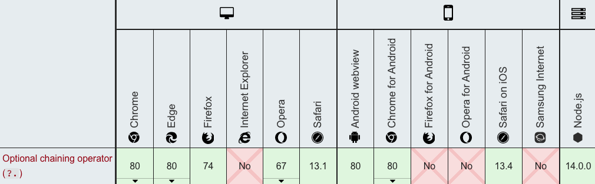

#### [Nullish coalescing operator (??)](https://developer.mozilla.org/zh-CN/docs/Web/JavaScript/Reference/Operators/Nullish_coalescing_operator)

> **空值合并操作符**（**`??`**）是一个逻辑操作符，当左侧的操作数为 [`null`](https://developer.mozilla.org/zh-CN/docs/Web/JavaScript/Reference/Global_Objects/null) 或者 [`undefined`](https://developer.mozilla.org/zh-CN/docs/Web/JavaScript/Reference/Global_Objects/undefined) 时，返回其右侧操作数，否则返回左侧操作数。
>
> 与[逻辑或操作符（`||`）](https://developer.mozilla.org/en-US/docs/Web/JavaScript/Reference/Operators/Logical_Operators#Logical_OR_2)不同，逻辑或操作符会在左侧操作数为[假值](https://developer.mozilla.org/zh-CN/docs/Glossary/Falsy)时返回右侧操作数。也就是说，如果使用 `||` 来为某些变量设置默认值，可能会遇到意料之外的行为。比如为假值（例如，`''` 或 `0`）时。见下面的例子。

- 基本使用

```javascript
const nullValue = null;
const emptyText = ""; // 空字符串，是一个假值，Boolean("") === false
const someNumber = 42;

const valA = nullValue ?? "valA 的默认值";
const valB = emptyText ?? "valB 的默认值";
const valC = someNumber ?? 0;

console.log(valA); // "valA 的默认值"
console.log(valB); // ""（空字符串虽然是假值，但不是 null 或者 undefined）
console.log(valC); // 42
```

- 与 `||`对比

> 由于 || 是一个布尔逻辑运算符，左侧的操作数会被强制转换成布尔值用于求值。任何假值（0， ''， NaN， null， undefined）都不会被返回。这导致如果你使用0，''或NaN作为有效值，就会出现不可预料的后果。

```javascript
let myText = ''; // An empty string (which is also a falsy value)

let notFalsyText = myText || 'Hello world';
console.log(notFalsyText); // Hello world

let preservingFalsy = myText ?? 'Hi neighborhood';
console.log(preservingFalsy); // '' (as myText is neither undefined nor null)
```

- 短路

> 与 OR 和 AND 逻辑操作符相似，当左表达式不为 `null` 或 `undefined` 时，不会对右表达式进行求值。

```javascript
function A() { console.log('函数 A 被调用了'); return undefined; }
function B() { console.log('函数 B 被调用了'); return false; }
function C() { console.log('函数 C 被调用了'); return "foo"; }

console.log( A() ?? C() );
// 依次打印 "函数 A 被调用了"、"函数 C 被调用了"、"foo"
// A() 返回了 undefined，所以操作符两边的表达式都被执行了

console.log( B() ?? C() );
// 依次打印 "函数 B 被调用了"、"false"
// B() 返回了 false（既不是 null 也不是 undefined）
// 所以右侧表达式没有被执行
```

- 不能与 `||` 和 `&&`共用

```javascript
null || undefined ?? "foo"; // 抛出 SyntaxError
true || undefined ?? "foo"; // 抛出 SyntaxError

// 但是，如果使用括号来显式表明运算优先级，是没有问题的：
(null || undefined ) ?? "foo"; // 返回 "foo"
```

- 使用`?.`操作符

```javascript
let customer = {
  name: "Carl",
  details: { age: 82 }
};
let customerCity = customer?.city ?? "暗之城";
console.log(customerCity); // “暗之城”
```

- 兼容性

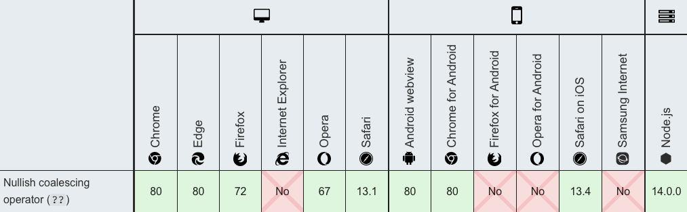


### ES10新特性（2019发布）

#### [Optional `catch` binding（catch 绑定可选）](https://github.com/tc39/proposal-optional-catch-binding)

> 允许在不使用`catch`绑定的情况下省略绑定，`catch` 的参数可以忽略

- 基本使用

```javascript
// 以往
try {
} catch (error) {
}

// 现在支持语法，catch 可以不使用抛出的 error
try {
  // ...
} catch {
  // ...
}
```

- 兼容性

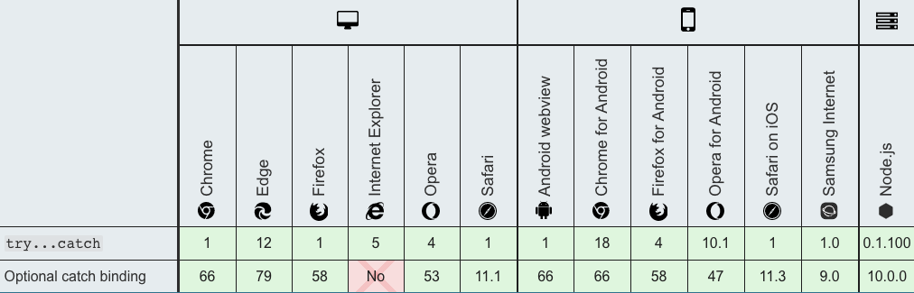

#### [JSON superset（json 超集）](https://github.com/tc39/proposal-json-superset)

> ECMAScript声称JSON是的子集[`JSON.parse`](https://tc39.github.io/ecma262/#sec-json.parse)，但（据充分记载）这是不正确的，因为JSON字符串可以包含未转义的U + 2028 LINE SEPARATOR和U + 2029 PARAGRAPH SEPARATOR字符，而ECMAScript字符串则不能。
>
> JSON语法由[ECMA-404](http://www.ecma-international.org/publications/standards/Ecma-404.htm)定义，并由[RFC 7159](https://tools.ietf.org/html/rfc7159)永久固定，但是ECMA-262的*DoubleStringCharacter*和*SingleStringCharacter*生产可以扩展为允许不转义的U + 2028 LINE SEPARATOR和U + 2029 PARAGRAPH SEPARATOR字符。
>
> 在 ES2019 之前，它会产生错误`SyntaxError: Invalid or unexpected token`

```javascript
const PS = eval("'\u2029'");
```

- 兼容性

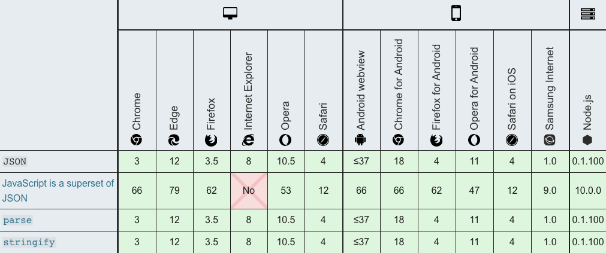

#### [`Symbol.prototype.description`](https://github.com/tc39/proposal-Symbol-description)

> `description` 是一个只读属性，它会返回 [`Symbol`](https://developer.mozilla.org/zh-CN/docs/Web/JavaScript/Reference/Global_Objects/Symbol) 对象的可选描述的字符串。
>
>  对象可以通过一个可选的描述创建，可用于调试，但不能用于访问 symbol 本身。`Symbol.prototype.description` 属性可以用于读取该描述。
>
> 与 `Symbol.prototype.toString()` 不同的是它不会包含 "`Symbol()`" 的字符串。具体请看实例。

- 基本使用

```javascript
Symbol('desc').toString();   // "Symbol(desc)"
Symbol('desc').description;  // "desc"
Symbol('').description;      // ""
Symbol().description;        // undefined

// well-known symbols
Symbol.iterator.toString();  // "Symbol(Symbol.iterator)"
Symbol.iterator.description; // "Symbol.iterator"

// global symbols
Symbol.for('foo').toString();  // "Symbol(foo)"
Symbol.for('foo').description; // "foo"
```

- 兼容性

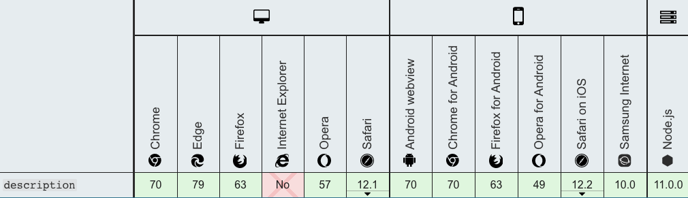

#### [`Function.prototype.toString` 修正](https://github.com/tc39/Function-prototype-toString-revision)

> 返回一个表示当前函数源代码的字符串，修正了返回函数中包含注释（箭头函数除外）

```javascript
function sum /* comments... */(a, b) {
  return a + b;
}
console.log(sum.toString());
// es2019 之前
// function sum (a, b) {
//     return a + b;
// }

// eS2019 之后
// function sum /* comments... */(a, b) {
//     return a + b;
// }

// native code 并不开放
console.log(Math.abs.toString());
// function abs() { [native code] }

// 箭头函数不会包含注释
const arrowFunction /* comment */ = /* comment */ () => {};
console.log(arrowFunction.toString()); // () => {}
```

#### [`Object.fromEntries`](https://github.com/tc39/proposal-object-from-entries)

> `Object.fromEntries(iterable)`方法接收一个键值对的列表参数，并返回一个带有这些键值对的**新对象**。
>
> 参数：`iterable`类似 [`Array`](https://developer.mozilla.org/zh-CN/docs/Web/JavaScript/Reference/Array) 、 [`Map`](https://developer.mozilla.org/zh-CN/docs/Web/JavaScript/Reference/Map) 或者其它实现了[可迭代协议](https://developer.mozilla.org/en-US/docs/Web/JavaScript/Reference/Iteration_protocols#The_iterable_protocol)的可迭代对象。
>
> 返回：一个由该迭代对象条目提供对应属性的新对象。

- 基本使用

```javascript
// Map to Object
const map = new Map([ ['foo', 'bar'], ['baz', 42] ]);
const obj = Object.fromEntries(map);
console.log(obj); // { foo: "bar", baz: 42 }

// Array to Object
const arr = [ ['0', 'a'], ['1', 'b'], ['2', 'c'] ];
const obj = Object.fromEntries(arr);
console.log(obj); // { 0: "a", 1: "b", 2: "c" }
```

- `Object.fromEntries` 是与 [`Object.entries()`](https://developer.mozilla.org/zh-CN/docs/Web/JavaScript/Reference/Global_Objects/Object/entries) 相反的方法

```javascript
const object1 = { a: 1, b: 2, c: 3 };

const object2 = Object.fromEntries(
  Object.entries(object1)
  .map(([ key, val ]) => [ key, val * 2 ])
);

console.log(object2);
// { a: 2, b: 4, c: 6 }
```

- 兼容性


#### [Well-formed `JSON.stringify`](https://github.com/tc39/proposal-well-formed-stringify)

> 防止`JSON.stringify`返回格式错误的Unicode字符串，ES2019 不是将未配对的代理代码点作为单个 UTF-16 代码单元返回，而是用 JSON 转义序列表示它们。

```javascript
// 之前
console.log(JSON.stringify("\uD800")); // "�"

// es2019之后
console.log(JSON.stringify("\uD800")); // "\ud800"
```

#### [`String.prototype.{trimStart,trimEnd}`](https://github.com/tc39/proposal-string-left-right-trim)

> **`trimStart()`** 方法从字符串的开头删除空格。`trimLeft()` 是此方法的别名。方法移除原字符串左端的连续空白符并返回一个新字符串，并不会直接修改原字符串本身。
>
> `trimEnd() `方法从一个字符串的末端移除空白字符。`trimRight()` 是这个方法的别名。方法移除原字符串右端的连续空白符并返回，并不会直接修改原字符串本身。

- 基本使用

```javascript
var str = "   foo  ";

console.log(str.length); // 8

str = str.trimStart()    // 等同于 str = str.trimLeft();
console.log(str.length); // 5
console.log(str);        // "foo  "

var str = "   foo  ";

alert(str.length); // 8

str = str.trimRight();  // 或写成str = str.trimEnd();
console.log(str.length); // 6
console.log(str);       // '   foo'
```

- 兼容性

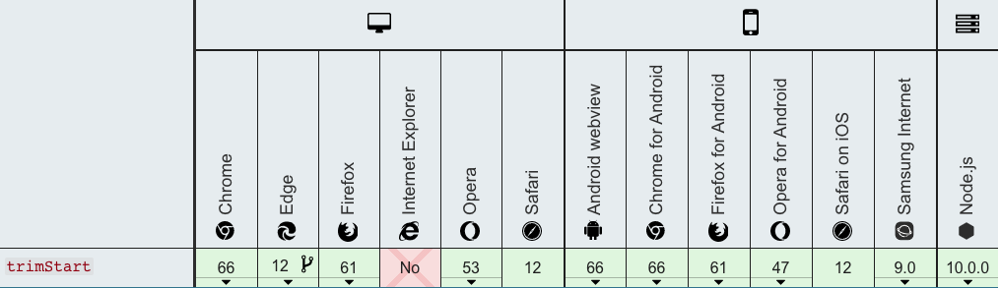

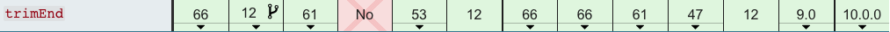

#### [`Array.prototype.{flat,flatMap}`](https://github.com/tc39/proposal-flatMap)

#####  `flat`

> `flat`: 方法会按照一个可指定的深度递归遍历数组，并将所有元素与遍历到的子数组中的元素合并为一个新数组返回。
>
> 语法：`var newArray = arr.flat([depth]`
>
> 入参`depth`(可选)：指定提取嵌套数组的结构深度，默认值为1。
>
> 返回：一个包含将数组与子数组中所有元素的新数组。

- `flat`基本使用

```javascript
var arr1 = [1, 2, [3, 4]];
arr1.flat(); 
// [1, 2, 3, 4]

var arr2 = [1, 2, [3, 4, [5, 6]]];
arr2.flat();
// [1, 2, 3, 4, [5, 6]]

var arr3 = [1, 2, [3, 4, [5, 6]]];
arr3.flat(2);
// [1, 2, 3, 4, 5, 6]

//使用 Infinity，可展开任意深度的嵌套数组
var arr4 = [1, 2, [3, 4, [5, 6, [7, 8, [9, 10]]]]];
arr4.flat(Infinity);
// [1, 2, 3, 4, 5, 6, 7, 8, 9, 10]

// 移除数组中的空项
var arr5 = [1, 2, , 4, 5];
arr5.flat(); // [1, 2, 4, 5]
```

##### `flatMap`

> 方法首先使用映射函数映射每个元素，然后将结果压缩成一个新数组。它与 [map](https://developer.mozilla.org/en-US/docs/Web/JavaScript/Reference/Global_Objects/Array/map) 连着深度值为1的 [flat](https://developer.mozilla.org/en-US/docs/Web/JavaScript/Reference/Global_Objects/Array/flat) 几乎相同，但 `flatMap` 通常在合并成一种方法的效率稍微高一些。

- 语法

```javascript
/**
	参数：
	  callback
			可以生成一个新数组中的元素的函数，可以传入三个参数：
			currentValue
				当前正在数组中处理的元素
			index可选
				可选的。数组中正在处理的当前元素的索引。
			array可选
				可选的。被调用的 map 数组
		thisArg可选
			可选的。执行 callback 函数时 使用的this 值。
			
	返回： 一个新的数组，其中每个元素都是回调函数的结果，并且结构深度 depth 值为1。		
 */
var new_array = arr.flatMap(function callback(currentValue[, index[, array]]) {
    // return element for new_array
}[, thisArg])
```

- 基本使用

```javascript
var arr1 = [1, 2, 3, 4];

arr1.map(x => [x * 2]); 
// [[2], [4], [6], [8]]

arr1.flatMap(x => [x * 2]);
// [2, 4, 6, 8]

// 只有一层 flattened
arr1.flatMap(x => [[x * 2]]);
// [[2], [4], [6], [8]]
```

##### 兼容性


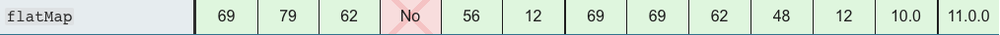

### ES9新特性（2018发布）

#### [Lifting template literal restriction](https://github.com/tc39/proposal-template-literal-revision)

#### [`s` (`dotAll`) flag for regular expressions](https://github.com/tc39/proposal-regexp-dotall-flag)

#### [RegExp named capture groups](https://github.com/tc39/proposal-regexp-named-groups)

#### [Rest/Spread Properties](https://github.com/tc39/proposal-object-rest-spread)

#### [RegExp Lookbehind Assertions](https://github.com/tc39/proposal-regexp-lookbehind)

#### [RegExp Unicode Property Escapes](https://github.com/tc39/proposal-regexp-unicode-property-escapes)

#### [`Promise.prototype.finally`](https://github.com/tc39/proposal-promise-finally)

#### [Asynchronous Iteration](https://github.com/tc39/proposal-async-iteration)

### ES8新特性（2017发布）

#### [`Object.values`/`Object.entries`](https://github.com/tc39/proposal-object-values-entries)

#### [String padding](https://github.com/tc39/proposal-string-pad-start-end)

#### [`Object.getOwnPropertyDescriptors`](https://github.com/tc39/proposal-object-getownpropertydescriptors)

#### [Trailing commas in function parameter lists and calls](https://github.com/tc39/proposal-trailing-function-commas)

#### [Async functions](https://github.com/tc39/ecmascript-asyncawait)

#### [Shared memory and atomics](https://github.com/tc39/ecmascript_sharedmem)

### ES7新特性（2016发布）

#### [`Array.prototype.includes`](https://github.com/tc39/Array.prototype.includes)

#### [Exponentiation operator](https://github.com/tc39/proposal-exponentiation-operator)

