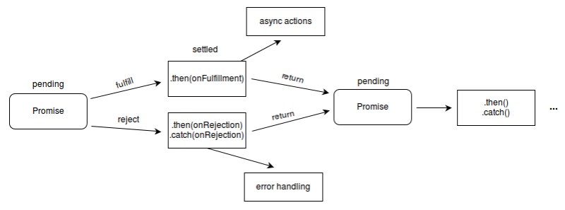
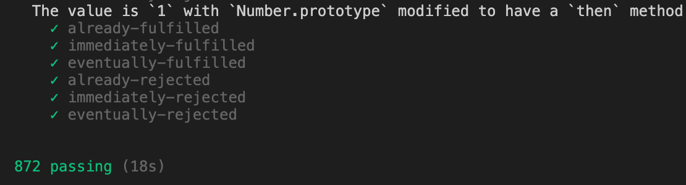

### Promise

- `Promise` 是异步编程的一种解决方案，比传统的异步解决方案【回调函数】和【事件】更合理、更强大。现已被 ES6 纳入进规范中；
- `Promise` 解决了“回调地狱”的痛点；

### 基本 API

#### 属性

- `Promise.length`
  - `length`属性，其值总是为 1 (构造器参数的数目).
- `Promise.prototype`
  - 表示 `Promise` 构造器的原型.

#### 类方法

- `Promise.resolve(value)`
  - 返回一个状态由给定`value`决定的`Promise`对象。
  - 如果该值是`thenable`(即，带有`then`方法的对象)，返回的`Promise`对象的最终状态由 then 方法执行决定；
  - 否则的话(该`value`为空，基本类型或者不带`then`方法的对象),返回的`Promise`对象状态为`fulfilled(resolved)`，并且将该`value`传递给对应的`then`方法；
  - 通常而言，如果你不知道一个值是否是`Promise`对象，使用`Promise.resolve(value)` 来返回一个`Promise`对象，这样就能将该`value`以`Promise`对象形式使用；
- `Promise.reject(reason)`
  - 返回一个状态为失败的`Promise`对象，并将给定的失败信息传递给对应的处理方法
- `Promise.race(iterable)`
  - 当`iterable`参数里的任意一个子`promise`被成功或失败后(即第一个执行完的`promise`)，父`promise`马上也会用子`promise`的成功返回值或失败详情作为参数调用父`promise`绑定的相应句柄，并返回该`promise`对象
- `Promise.allSettled(iterable)`
  - 返回一个在所有给定的 promise 已被 resolved 或被 rejected 后决议的 promise，并带有一个对象数组，每个对象表示对应的`promise`结果
- `Promise.all(iterable)`
  - 这个方法返回一个新的`promise`对象，
  - 该`promise`对象在`iterable`参数对象里所有的`promise`对象都成功的时候才会触发成功
  - 一旦有任何一个`iterable`里面的`promise`对象失败则立即触发该`promise`对象的失败
  - 这个新的`promise`对象在触发成功状态以后，会把一个包含`iterable`里所有`promise`返回值的数组作为成功回调的返回值，顺序跟`iterable`的顺序保持一致；
  - 如果这个新的`promise`对象触发了失败状态，它会把`iterable`里第一个触发失败的`promise`对象的错误信息作为它的失败错误信息。
  - `Promise.all`方法常被用于处理多个`promise`对象的状态集合。

### 原型

#### 原型属性

- `Promise.prototype.constructor`
  - 返回被创建的实例函数. 默认为 `Promise` 函数
  - 构造函数只执行一次

#### 原型方法

- `Promise.prototype.then(onFulfilled, onRejected)`
  - 添加解决(`fulfillment`)和拒绝(`rejection`)回调到当前 `promise`, 返回一个新的 `promise`, 将以回调的返回值来 `resolve`;
  - onRejected 捕获上一个 then 抛出的异常，不会捕获当前 `onFulfilled` 中抛出的异常；
- `Promise.prototype.catch(onRejected)`
  - 添加一个拒绝(`rejection`) 回调到当前 `promise`, 返回一个新的`promise`。
  - 当这个回调函数被调用，新 `promise` 将以它的返回值来 resolve，否则如果当前`promise` 进入`fulfilled`状态，则以当前`promise`的完成结果作为新`promise`的完成结果.
- `Promise.prototype.finally(onFinally)`
  - 添加一个事件处理回调于当前`promise`对象，并且在原`promise`对象解析完毕后，返回一个新的`promise`对象。
  - 回调会在当前`promise`运行完毕后被调用，无论当前`promise`的状态是完成(`fulfilled`)还是失败(`rejected`)

### 核心要点

• `process.nextTick` 和 `promise.then` 都属于 微任务（`microtask`），而 `setImmediate`、`setTimeout`、`setInterval` 属于 宏任务（`macrotask`），事件循环先执行宏任务，再执行所有微任务
• `Promise` 构造函数是同步执行的，`promise.then` 中的函数是异步执行的

```javascript
const promise = new Promise((resolve, reject) => {
  // 构造函数同步执行
  console.log(1);
  resolve();
  console.log(2);
});
promise.then(() => {
  // 异步执行
  console.log(3);
});
console.log(4);

// ------------执行结果-------------
1;
2;
4;
3;
```

- `promise` 有 3 种状态：`pending`、`resolved（fulfilled）` 或 `rejected`。状态改变只能是 `pending`->`resolved` 或者 `pending`->`rejected`，状态一旦改变则不能再变。
  - `pending`: 初始状态，既不是成功，也不是失败状态。
  - `resolved`(`fulfilled`): 意味着操作成功完成。
  - `rejected`: 意味着操作失败。

```javascript
const p1 = new Promise((resolve, reject) => {
  setTimeout(() => {
    resolve('success')
  }, 1000)
});
const p2 = promise1.then(() => {
  throw new Error('error!!!')
});
console.log('promise1', p1);
console.log('promise2', p2);
setTimeout(() => {
  console.log('promise1', p1)
  console.log('promise2', p2)
}, 2000);

// ------------执行结果-------------
promise1 Promise {<pending>}
promise2 Promise {<pending>}
Uncaught (in promise) Error: error!!!
    at <anonymous>:7:9
Promise.then (async)
promise1 Promise {<resolved>: "success"}
promise2 Promise {<rejected>: Error: error!!!
    at <anonymous>:7:9}
```

- 构造函数中的 `resolve` 或 `reject` 只有第一次执行有效，多次调用没有任何作用

```javascript
new Promise((resolve, reject) => {
  resolve("resolve1");
  reject("reject");
  resolve("resolve2");
})
  .then((res) => {
    console.log("then: ", res);
  })
  .catch((err) => {
    console.log("catch: ", err);
  });

// ------------执行结果-------------
then: resolve1;
```

- `promise` 每次调用 `.then` 或者`.catch` 都会返回一个新的 `promise`，从而实现了链式调用

```javascript
const p1 = Promise.resolve(1); // 返回 Promise
// 返回 Promise
const p2 = p1
  .then((res) => {
    console.log(res);
    return 2;
  })
  .catch((err) => {
    return 3;
  });
// 返回 Promise
const p3 = p2.then((res) => {
  console.log(res);
});

// ------------执行结果-------------
1;
2;
```

- `promise` 的 `.then` 或者 `.catch` 可以被调用多次，但这里 `Promise` 构造函数只执行一次。
  - `promise` 内部状态一经改变，并且有了一个值，那么后续每次调用 `.then` 或者 `.catch` 都会直接拿到该值

```javascript
const p5 = new Promise((resolve, reject) => {
  // 构造函数只执行一次
  setTimeout(() => {
    console.log('start')
    resolve('success'); // 第一次生效
        resolve('success1'); // 执行无效
  }, 1000)
})
p5.then((res) => {
  console.log('promise1', res);
});
p5.then((res) => {
  console.log('promise2', res)
});

// ------------执行结果-------------
start
promise1 success
promise2 success
```

- `.then` 可以接收两个参数，第一个是处理成功的函数，第二个是处理错误的函数。
  - `.catch` 是 `.then` 第二个参数的简便写法；
  - `.then` 的第二个处理错误的函数捕获不了第一个处理成功的函数抛出的错误，而后续的 `.catch` 可以捕获之前的错误

```javascript
Promise.resolve().then(function success1 (res) {
    throw new Error('error'); // 第一个 then 抛出 error 下一个 then 才能接收
  }, function fail1 (e) {
    console.error('error1: ', e)
}).then(function success2 (res) {}, function fail2 (e) {
    // 接收上一个 then 抛出的 error
    console.error('error2: ', e)
});

// ------------执行结果-------------
error2:  Error: error
    at success1 (<anonymous>:2:11)
```

- `.then` 或者 `.catch` 的参数期望是函数，传入非函数则会发生值穿透

```javascript
Promise.resolve(1)
  .then(2) // 这一步会穿透
  .then(Promise.resolve(3)) // 这里 Promise.resolve(3) 为 Promise 对象，这一步也会穿透
  .then(console.log); // 这里接收到第一次 resolve 的 1

// ------------执行结果-------------
1;
```

### 造轮子

#### 结构

```javascript
function Promise(fn) {}

// 中断抛出结果集
Promise.resolve = function (value) {};
// 中断抛出异常
Promise.reject = function (reason) {};
// 返回多个promise集合请求中最快返回的结果
Promise.race = function (iterable) {};
// 返回多个promise集合所有不论正常或者异常的结果集
Promise.allSettled = function (iterable) {};
// 返回多个promise集合所有正常的结果集，有错误则中断返回该错误结果
Promise.all = function (iterable) {};

// 原型方法 then, 返回新的promise形成链式调用
Promise.prototype.then = function (onResolved, onRejected) {};
// 原型方法 catch, 抛出异常
Promise.prototype.catch = function (onError) {};
// 原型方法 promise 正常或者异常之后的最后一次处理
Promise.prototype.finally = function (onFinally) {};
```

#### Promise 构造函数

```javascript
function resolve(value) {
  var _this = this;

  // 状态不为 pending 则不执行，这里避免多次触发
  if (_this._status !== "pending") return;

  setTimeout(function () {
    _this._status = "fulfilled";
    _this._value = value;
    _this._onResolvedFns.forEach(function (cb) {
      cb && cb();
    });
  });
}

function reject(error) {
  var _this = this;

  // 状态不为 pending 则不执行，这里避免多次触发
  if (_this._status !== "pending") return;

  setTimeout(function () {
    _this._status = "rejected";
    _this._error = error;
    _this._onRejectedFns.forEach(function (cb) {
      cb && cb();
    });
  });
}

function isFunction(func) {
  return typeof func === "function";
}

function isObject(func) {
  return typeof func === "object";
}

function Promise(fn) {
  if (!isObject(this)) {
    throw new TypeError("Promise 必须是 new 实例化的对象");
  }
  if (!isFunction(fn)) {
    throw new TypeError("Promise 构造函数入参必须是函数");
  }

  // 状态 pending/fulfilled/rejected
  this._status = "pending"; // 默认 pending
  this._value = null; // 值
  this._error = null; // 异常

  // 成功的回调
  this._onResolvedFns = [];
  // 失败的回调
  this._onRejectedFns = [];

  try {
    // 绑定当前上下文
    fn(resolve.bind(this), reject.bind(this));
  } catch (e) {
    reject(e);
  }
}
```

#### `Promise.prototype.then` 链式回调

```javascript
/**
 * 解析 promise
 *  若回调为 promise 实例，则继续流式解析
 *
 * @param {*} promise
 * @param {*} result 回调结果
 * @param {*} resolve
 * @param {*} reject
 */
function resolvePromise(promise, result, resolve, reject) {
  // 循环引用检测
  if (promise === result) return reject(new TypeError("循环引用"));

  if (result instanceof Promise) {
    result.then(function (newResult) {
      resolvePromise(promise, newResult, resolve, reject);
    }, reject);
  } else if (isObject(result) || isFunction(result)) {
    if (result === null) return resolve(result);

    var then;

    try {
      then = result.then;
    } catch (error) {
      return reject(error);
    }

    if (!isFunction(then)) return resolve(result);

    var called = false; // 调用锁

    try {
      var _thenLock = function (cb) {
        // 防止再次调用
        if (called) return;
        called = true; // 标记锁
        cb && cb();
      };

      // then 流式调用
      then.call(
        result,
        function (nextResult) {
          _thenLock(function () {
            resolvePromise(promise, nextResult, resolve, reject);
          });
        },
        function (r) {
          //只要失败了就失败了
          _thenLock(function () {
            reject(r);
          });
        }
      );
    } catch (e) {
      _thenLock(function () {
        reject(e);
      });
    }
  } else {
    resolve(result);
  }
}

// 原型方法 then, 返回新的promise形成链式调用
Promise.prototype.then = function (onResolved, onRejected) {
  // then 接收两个函数，若果不是函数则直接造成值穿透，即上一个 then 的值继续向下走
  onResolved = isFunction(onResolved)
    ? onResolved
    : function (y) {
        return y;
      };
  onRejected = isFunction(onRejected)
    ? onRejected
    : function (err) {
        throw err;
      };

  var _this = this;

  var promise = new Promise(function (resolve, reject) {
    if (_this._status === "pending") {
      // pending 状态
      // 存放成功回调
      _this._onResolvedFns.push(function () {
        setTimeout(function () {
          try {
            resolvePromise(promise, onResolved(_this._value), resolve, reject);
          } catch (error) {
            reject(error);
          }
        });
      });
      // 存放失败的回调
      _this._onRejectedFns.push(function () {
        setTimeout(function () {
          try {
            resolvePromise(promise, onRejected(_this._error), resolve, reject);
          } catch (error) {
            reject(error);
          }
        });
      });
    } else {
      setTimeout(function () {
        try {
          // fulfilled / rejected 状态 解析回调
          resolvePromise(
            promise,
            _this._status === "fulfilled"
              ? onResolved(_this._value)
              : onRejected(_this._error),
            resolve,
            reject
          );
        } catch (error) {
          reject(error);
        }
      });
    }
  });

  return promise;
};
```

#### `Promise.prototype.catch` 异常捕获

```javascript
// 原型方法 catch, 抛出异常
Promise.prototype.catch = function (onError) {
  // catch 方法就是then方法没有成功的简写
  return this.then(null, onError);
};
```

#### `Promise.prototype.finally` 结束调用

```javascript
// 原型方法 promise 正常或者异常之后的最后一次处理
Promise.prototype.finally = function (onFinally) {
  var _finally = Promise.resolve(onFinally());

  return this.then(
    function (value) {
      return _finally.then(function () {
        return value;
      });
    },
    function (error) {
      return _finally.then(function () {
        throw error;
      });
    }
  );
};
```

#### `Promise.resolve`

```javascript
// 中断抛出结果集
Promise.resolve = function (value) {
  return new Promise(function (resolve) {
    resolve(value);
  });
};
```

#### `Promise.reject`

```javascript
// 中断抛出异常
Promise.reject = function (reason) {
  return new Promise(function (resolve, reject) {
    reject(reason);
  });
};
```

#### `Promise.all`

```javascript
// 返回多个promise集合所有正常的结果集，有错误则中断返回该错误结果
Promise.all = function (iterable) {
  return new Promise(function (resolve, reject) {
    var array = Array.prototype.slice.call(iterable);
    if (!array.length) return resolve([]);

    var results = [];
    var count = 0;

    for (var i = 0; i < array.length; i++) {
      (function (i) {
        Promise.resolve(array[i])
          .then(function (res) {
            results[i] = res;
            count++;

            if (count === array.length) {
              resolve(results);
            }
          })
          .catch(function (error) {
            reject(error);
          });
      })(i);
    }
  });
};
```

#### `Promise.race`

```javascript
// 返回多个promise集合请求中最快返回的结果
Promise.race = function (iterable) {
  return new Promise(function (resolve, reject) {
    // 浅拷贝
    var array = Array.prototype.slice.call(iterable);
    for (var i = 0; i < array.length; i++) {
      Promise.resolve(array[i]).then(resolve, reject);
    }
  });
};
```

#### `Promise.allSettled`

```javascript
// 返回多个promise集合所有不论正常或者异常的结果集
Promise.allSettled = function (iterable) {
  return new Promise(function (resolve, reject) {
    var array = Array.prototype.slice.call(iterable);
    if (!array.length) return resolve([]);

    var results = [];
    var count = 0;

    for (var i = 0; i < array.length; i++) {
      (function (i) {
        Promise.resolve(array[i]).finally(function (value) {
          results[i] = res;
          count++;

          if (count === array.length) {
            resolve(results);
          }
        });
      })(i);
    }
  });
};
```

### `Promise/A+` 测试

- 安装 `promises-tests` 测试包
- 编写测试文件 `promise.spec.js`

```javascript
var Promise = require("./promise");

Promise.deferred = function () {
  var result = {};
  result.promise = new Promise(function (resolve, reject) {
    result.resolve = resolve;
    result.reject = reject;
  });

  return result;
};

module.exports = Promise;
```

- 执行测试脚本 `promises-tests promise.spec.js`
- 查看用例执行成功
  

### 完整代码

```javascript
function resolve(value) {
  var _this = this;

  // 状态不为 pending 则不执行，这里避免多次触发
  if (_this._status !== "pending") return;

  setTimeout(function () {
    _this._status = "fulfilled";
    _this._value = value;
    _this._onResolvedFns.forEach(function (cb) {
      cb && cb();
    });
  });
}

function reject(error) {
  var _this = this;

  // 状态不为 pending 则不执行，这里避免多次触发
  if (_this._status !== "pending") return;

  setTimeout(function () {
    _this._status = "rejected";
    _this._error = error;
    _this._onRejectedFns.forEach(function (cb) {
      cb && cb();
    });
  });
}

function isFunction(func) {
  return typeof func === "function";
}

function isObject(func) {
  return typeof func === "object";
}

/**
 * 解析 promise
 *  若回调为 promise 实例，则继续流式解析
 *
 * @param {*} promise
 * @param {*} result 回调结果
 * @param {*} resolve
 * @param {*} reject
 */
function resolvePromise(promise, result, resolve, reject) {
  // 循环引用检测
  if (promise === result) return reject(new TypeError("循环引用"));

  if (result instanceof Promise) {
    result.then(function (newResult) {
      resolvePromise(promise, newResult, resolve, reject);
    }, reject);
  } else if (isObject(result) || isFunction(result)) {
    if (result === null) return resolve(result);

    var then;

    try {
      then = result.then;
    } catch (error) {
      return reject(error);
    }

    if (!isFunction(then)) return resolve(result);

    var called = false; // 调用锁

    try {
      var _thenLock = function (cb) {
        // 防止再次调用
        if (called) return;
        called = true; // 标记锁
        cb && cb();
      };

      // then 流式调用
      then.call(
        result,
        function (nextResult) {
          _thenLock(function () {
            resolvePromise(promise, nextResult, resolve, reject);
          });
        },
        function (r) {
          //只要失败了就失败了
          _thenLock(function () {
            reject(r);
          });
        }
      );
    } catch (e) {
      _thenLock(function () {
        reject(e);
      });
    }
  } else {
    resolve(result);
  }
}

function Promise(fn) {
  if (!isObject(this)) {
    throw new TypeError("Promise 必须是 new 实例化的对象");
  }
  if (!isFunction(fn)) {
    throw new TypeError("Promise 构造函数入参必须是函数");
  }

  // 状态 pending/fulfilled/rejected
  this._status = "pending"; // 默认 pending
  this._value = null; // 值
  this._error = null; // 异常

  // 成功的回调
  this._onResolvedFns = [];
  // 失败的回调
  this._onRejectedFns = [];

  try {
    // 绑定当前上下文
    fn(resolve.bind(this), reject.bind(this));
  } catch (e) {
    reject(e);
  }
}

// 原型方法 then, 返回新的promise形成链式调用
Promise.prototype.then = function (onResolved, onRejected) {
  // then 接收两个函数，若果不是函数则直接造成值穿透，即上一个 then 的值继续向下走
  onResolved = isFunction(onResolved)
    ? onResolved
    : function (y) {
        return y;
      };
  onRejected = isFunction(onRejected)
    ? onRejected
    : function (err) {
        throw err;
      };

  var _this = this;

  var promise = new Promise(function (resolve, reject) {
    if (_this._status === "pending") {
      // pending 状态
      // 存放成功回调
      _this._onResolvedFns.push(function () {
        setTimeout(function () {
          try {
            resolvePromise(promise, onResolved(_this._value), resolve, reject);
          } catch (error) {
            reject(error);
          }
        });
      });
      // 存放失败的回调
      _this._onRejectedFns.push(function () {
        setTimeout(function () {
          try {
            resolvePromise(promise, onRejected(_this._error), resolve, reject);
          } catch (error) {
            reject(error);
          }
        });
      });
    } else {
      setTimeout(function () {
        try {
          // fulfilled / rejected 状态 解析回调
          resolvePromise(
            promise,
            _this._status === "fulfilled"
              ? onResolved(_this._value)
              : onRejected(_this._error),
            resolve,
            reject
          );
        } catch (error) {
          reject(error);
        }
      });
    }
  });

  return promise;
};

// 原型方法 catch, 抛出异常
Promise.prototype.catch = function (onError) {
  // catch 方法就是then方法没有成功的简写
  return this.then(null, onError);
};

// 原型方法 promise 正常或者异常之后的最后一次处理
Promise.prototype.finally = function (onFinally) {
  var _finally = Promise.resolve(onFinally());

  return this.then(
    function (value) {
      return _finally.then(function () {
        return value;
      });
    },
    function (error) {
      return _finally.then(function () {
        throw error;
      });
    }
  );
};

// 中断抛出结果集
Promise.resolve = function (value) {
  return new Promise(function (resolve) {
    resolve(value);
  });
};

// 中断抛出异常
Promise.reject = function (reason) {
  return new Promise(function (resolve, reject) {
    reject(reason);
  });
};

// 返回多个promise集合请求中最快返回的结果
Promise.race = function (iterable) {
  return new Promise(function (resolve, reject) {
    // 浅拷贝
    var array = Array.prototype.slice.call(iterable);
    for (var i = 0; i < array.length; i++) {
      Promise.resolve(array[i]).then(resolve, reject);
    }
  });
};

// 返回多个promise集合所有不论正常或者异常的结果集
Promise.allSettled = function (iterable) {
  return new Promise(function (resolve, reject) {
    var array = Array.prototype.slice.call(iterable);
    if (!array.length) return resolve([]);

    var results = [];
    var count = 0;

    for (var i = 0; i < array.length; i++) {
      (function (i) {
        Promise.resolve(array[i]).finally(function (value) {
          results[i] = res;
          count++;

          if (count === array.length) {
            resolve(results);
          }
        });
      })(i);
    }
  });
};

// 返回多个promise集合所有正常的结果集，有错误则中断返回该错误结果
Promise.all = function (iterable) {
  return new Promise(function (resolve, reject) {
    var array = Array.prototype.slice.call(iterable);
    if (!array.length) return resolve([]);

    var results = [];
    var count = 0;

    for (var i = 0; i < array.length; i++) {
      (function (i) {
        Promise.resolve(array[i])
          .then(function (res) {
            results[i] = res;
            count++;

            if (count === array.length) {
              resolve(results);
            }
          })
          .catch(function (error) {
            reject(error);
          });
      })(i);
    }
  });
};

module.exports = Promise;
```

### 学习参考

- [promise 源码参考](https://github.com/then/promise)
- [Promise MDN](https://developer.mozilla.org/zh-CN/docs/Web/JavaScript/Reference/Global_Objects/Promise)
- [Promise 必知必会的十道题](https://juejin.im/post/5a04066351882517c416715d)
- [100 行代码实现 Promises/A+ 规范](https://mp.weixin.qq.com/s/qdJ0Xd8zTgtetFdlJL3P1g)
- [你好，JavaScript 异步编程—— 理解 JavaScript 异步的美妙](https://juejin.im/post/5b56c3586fb9a04faa79a8e0)
- [一起学习造轮子（一）：从零开始写一个符合 Promises/A+规范的 promise](https://juejin.im/post/5b16800fe51d4506ae719bae#heading-34)
- [Promise 实现原理（附源码）](https://juejin.im/post/5b83cb5ae51d4538cc3ec354)

### 小结

> 以上是对 promise 的学习纪要，希望能够帮助到大家，如有不对的地方，希望大家不吝指正，谢谢。
