> 此文初衷如下几点：
> 1. 源于为了了解不同阶段浏览器对不有些方法的支持情况，方便快速定位不同浏览器下的兼容问题；
> 2. 同时做为文档查阅，能更清楚的了解每一阶段的新特性；
> 3. 帮助大家面试加分，试问熟知每个阶段的更新细节总归会给面试官好印象；
> 
> 以此与大家共勉，有帮助的话顺手给个赞，谢谢~~

### ES11新特性（2020发布）

> ECMAScript 语言规范的第 11 版本。

#### String.prototype.matchAll(regexp)

> `matchAll`方法返回一个包含所有匹配正则表达式的结果及分组捕获组的迭代器。
>
> 入参：`regexp`为正则表达式对象。如果所传参数不是一个正则表达式对象，则会隐式地使用 `new RegExp(obj)` 将其转换为一个 [`RegExp`](https://developer.mozilla.org/zh-CN/docs/Web/JavaScript/Reference/RegExp) 。
>
> 返回：一个迭代器（不可重用，结果耗尽需要再次调用方法，获取一个新的迭代器）。

- 基本使用

```javascript
const regexp = /t(e)(st(\d?))/g;
const str = "test1test2";

// 返回迭代器
const iterator = str.matchAll(regexp);
const array = [...iterator];

console.log(array[0]);
// expected output: Array ["test1", "e", "st1", "1"]

console.log(array[1]);
// expected output: Array ["test2", "e", "st2", "2"]
```

- 控制台执行

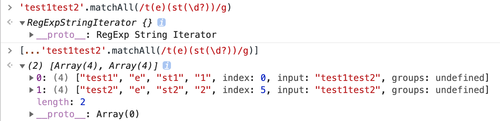

- 注意事项：`matchAll`入参`regexp`必须跟上`g`按全文查找，否则会抛出`TypeError`异常

  - `/i` ：忽略大小写

  - `/g` ：全文查找出现的所有匹配字符

  - `/m` ：多行查找

  - `/ig`：全文查找、忽略大小写

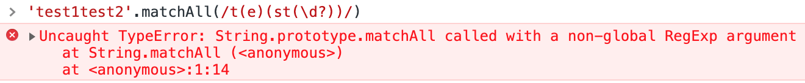

- 兼容性

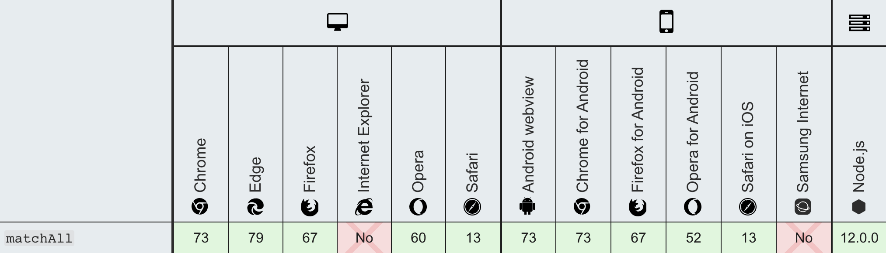

#### Dynamic import 动态引入

> 标准用法的`import`导入的模块是静态的，会使所有被导入的模块，在加载时就被编译（无法做到按需编译，降低首页加载速度）。
>
> 有些场景中，你可能希望根据条件导入模块或者按需导入模块，这时你可以使用动态导入代替静态导入。下面的是你可能会需要动态导入的场景：

- 使用场景

  - 当静态导入的模块很明显的降低了代码的加载速度且被使用的可能性很低，或者并不需要马上使用它。
  - 当静态导入的模块很明显的占用了大量系统内存且被使用的可能性很低。
  - 当被导入的模块，在加载时并不存在，需要异步获取
  - 当导入模块的说明符，需要动态构建。（静态导入只能使用静态说明符）
  - 当被导入的模块有副作用（这里说的副作用，可以理解为模块中会直接运行的代码），这些副作用只有在触发了某些条件才被需要时。（原则上来说，模块不能有副作用，但是很多时候，你无法控制你所依赖的模块的内容）

- 常规用作异步按需加载

```javascript
function callback() {
  // 同样支持 await 写法
  import("moduleB")
    .then((module) => {
      // todo
    })
    .catch((err) => {
      // load error
    });
}
```

- 兼容性

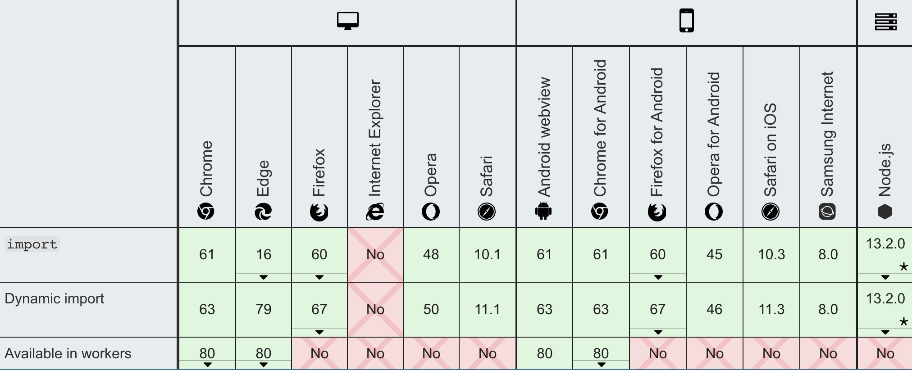

#### import.meta

> `import.meta`是一个给 JavaScript 模块暴露特定上下文的元数据属性的对象。它包含了这个模块的信息，比如说这个模块的 URL。

- 基本使用

  - 通过`script`标签引用

  ```javascript
  <script type="module" src="my-module.mjs"></script>;

  // 在 my-module.mjs 中使用
  console.log(import.meta); // { url: "file:///home/user/my-module.mjs" }
  ```

  - 通过 `import`引用

  ```javascript
  // a.js
  import "b.js?param1=test";

  // b.js
  import.meta.url; // ...b.js?param1=test
  ```

- 兼容性

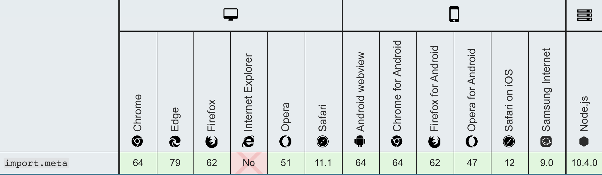

#### export * as alias from namespace

> 模块重定向

- 基本使用

```javascript
// 如果我们想要在当前模块中，导出指定导入模块的默认导出（等于是创建了一个“重定向”）：
// module "redirect-module.js"
export {default} from './other-module';
export * from './other-module';
export * as otherName from './other-module';
```

- 兼容性

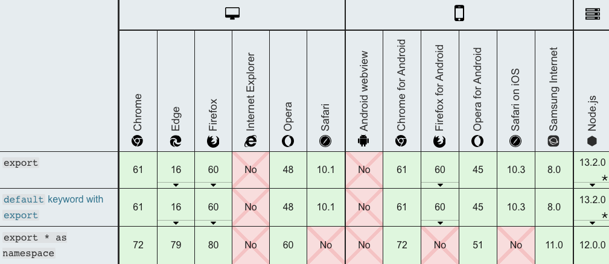

#### Promise.allSettled(iterable)

> 入参：一个可迭代的对象，其中每个成员都是 `Promise`
>
> 返回：一个在所有给定的`promise`都已经`fulfilled`或`rejected`后的`promise`，并带有一个对象数组，每个对象表示对应的`promise`结果。
>
> 当您有多个彼此不依赖的异步任务成功完成时，或者您总是想知道每个`promise`的结果时，通常使用它。
>
> 相比之下，`Promise.all()` 更适合彼此相互依赖或者在其中任何一个`reject`时立即结束。

- 基本使用

```javascript
const promise1 = Promise.resolve(3);
const promise2 = new Promise((resolve, reject) =>
  setTimeout(reject, 100, "foo")
);
const promises = [promise1, promise2];

Promise.allSettled(promises).then((results) =>
  results.forEach((result) => console.log(result.status))
);

// Promise {<pending>}
// fulfilled
// rejected
```

- 兼容性

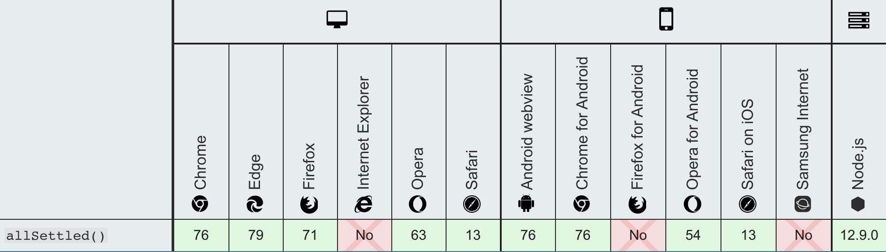

#### BigInt

> 最新的 ECMAScript 标准定义了 8 种数据类型：7 中原始类型：Boolean、Null、Undefined、Number、BigInt、String、Symbol；和 Object；
>
> [`BigInt`](https://developer.mozilla.org/zh-CN/docs/Web/JavaScript/Reference/Global_Objects/BigInt)类型是 JavaScript 中的一个基础的数值类型，可以用任意精度表示整数。使用 BigInt，您可以安全地存储和操作大整数，甚至可以超过数字的安全整数限制。
>
> **BigInt** 是一种内置对象，它提供了一种方法来表示大于 `2^53 - 1` 的整数。这原本是 Javascript 中可以用 [`Number`](https://developer.mozilla.org/zh-CN/docs/Web/JavaScript/Reference/Global_Objects/Number) 表示的最大数字。**BigInt** 可以表示任意大的整数。
>
> `BigInt`是通过在整数末尾附加 `n `或调用构造函数来创建的。
>
> 通过使用常量[`Number.MAX_SAFE_INTEGER`](https://developer.mozilla.org/zh-CN/docs/Web/JavaScript/Reference/Global_Objects/Number/MAX_SAFE_INTEGER)(2^53 - 1)，您可以获得可以用数字递增的最安全的值。通过引入 BigInt，您可以操作超过[`Number.MAX_SAFE_INTEGER`](https://developer.mozilla.org/zh-CN/docs/Web/JavaScript/Reference/Global_Objects/Number/MAX_SAFE_INTEGER)的数字。
>
> 可以对`BigInt`使用运算符` +、``*、``-、``** `和`%`，就像对数字一样。BigInt 严格来说并不等于一个数字，但它是松散的。

- 基本使用

```javascript
const x = 2n ** 53n;
// ↪ 9007199254740992n
const y = x + 1n;
// ↪ 9007199254740993n
const previousMaxSafe = BigInt(Number.MAX_SAFE_INTEGER);
// ↪ 9007199254740991n
const maxPlusOne = previousMaxSafe + 1n;
// ↪ 9007199254740992n
const theFuture = previousMaxSafe + 2n;
// ↪ 9007199254740993n, this works now!
const multi = previousMaxSafe * 2n;
// ↪ 18014398509481982n
const subtr = multi – 10n;
// ↪ 18014398509481972n
const mod = multi % 10n;
// ↪ 2n
const bigN = 2n ** 54n;
// ↪ 18014398509481984n
bigN * -1n
// ↪ –18014398509481984n
```

- 在将`BigInt`转换为`Boolean`时，它的行为类似于一个数字：` if、``||、``&&、``Boolean 和``!。 `

```javascript
0n === 0;
// ↪ false
0n == 0;
// ↪ true
```

- `BigInt`不能与数字互换操作。否则，将抛出`TypeError`。

```javascript
1 + 1n; // Uncaught TypeError: Cannot mix BigInt and other types, use explicit conversions
```

- 当使用 `BigInt` 时，带小数的运算会被取整。

```javascript
const expected = 4n / 2n;
// ↪ 2n
const rounded = 5n / 2n;
// ↪ 2n, not 2.5n
```

- Number 和 BigInt 可以进行比较

```javascript
1n == 1;
// ↪ true
1n === 1;
// ↪ false
1n < 2;
// ↪ true
2n > 1;
// ↪ true
2 > 2;
// ↪ false
2n > 2;
// ↪ false
2n >= 2;
// ↪ true

// 两者也可以混在一起进行比较
const mixed = [4n, 6, -12n, 10, 4, 0, 0n];
// ↪  [4n, 6, -12n, 10, 4, 0, 0n]
mixed.sort();
// ↪ [-12n, 0, 0n, 10, 4n, 4, 6]

// 注意被 Object 包装的 BigInts 使用 object 的比较规则进行比较，只用同一个对象在比较时才会相等。
0n === Object(0n); // false
Object(0n) === Object(0n); // false
0n === 0n; // true
const o = Object(0n);
o === o; // true
```

- 兼容性

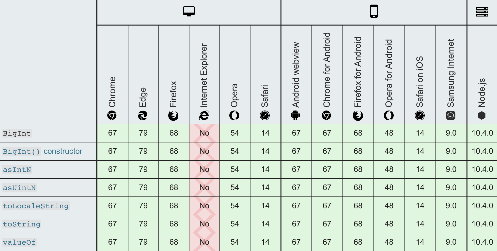

#### globalThis

> 全局属性 `globalThis` 包含全局的 `this` 值，类似于全局对象（global object）。

- 之前不同环境下

  - `web`中：可以通过 `window`、`self` 或者 `frames` 取到全局对象
  - `Web Workers`中：只有`self`可以
  - `Node.js`中：必须使用`global`
  - 在松散模式下，可以通过`this`来获取全局对象
  - 在严格模式下，`this`会返回`undefined`，可以通过`function(){return this}`

- `globalThis`提供了一个标准的方式来获取不同环境下的全局`this`对象（全局对象自身）

  > 不像 `window` 或者 `self` 这些属性，它确保可以在有无窗口的各种环境下正常工作。所以，你可以安心的使用 `globalThis`，不必担心它的运行环境。为便于记忆，你只需要记住，全局作用域中的 `this` 就是 `globalThis`。

- HTML 与 WindowProxy

  > 在很多引擎中， `globalThis` 被认为是真实的全局对象的引用，但是在浏览器中，由于 iframe 以及跨窗口安全性的考虑，它实际引用的是真实全局对象（不可以被直接访问）的 [`Proxy`](https://developer.mozilla.org/zh-CN/docs/Web/JavaScript/Reference/Global_Objects/Proxy) 代理。在通常的应用中，很少会涉及到代理与对象本身的区别，但是也需要加以注意。

- 基本使用

```javascript
// 没有 globalThis 之前获取全局对象的统一方式
var getGlobal = function () {
  if (typeof self !== "undefined") {
    return self;
  }
  if (typeof window !== "undefined") {
    return window;
  }
  if (typeof global !== "undefined") {
    return global;
  }
  throw new Error("unable to locate global object");
};

var globals = getGlobal();

if (typeof globals.setTimeout !== "function") {
  // 此环境中没有 setTimeout 方法！
}

// 有了 globalThis 之后，只需
if (typeof globalThis.setTimeout !== "function") {
  //  此环境中没有 setTimeout 方法！
}
```

- 兼容性

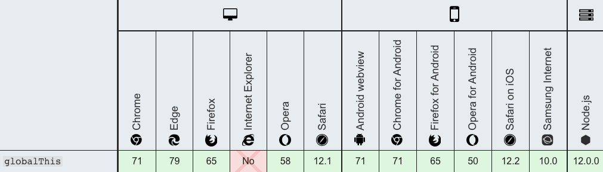

#### [Optional chaining (?.)](https://developer.mozilla.org/zh-CN/docs/Web/JavaScript/Reference/Operators/Optional_chaining)

> **可选链**操作符( **`?.`** )允许读取位于连接对象链深处的属性的值，而不必明确验证链中的每个引用是否有效。`?.` 操作符的功能类似于 `.` 链式操作符，不同之处在于，在引用为空([`null`](https://developer.mozilla.org/zh-CN/docs/Web/JavaScript/Reference/Global_Objects/null) 或者 [`undefined`](https://developer.mozilla.org/zh-CN/docs/Web/JavaScript/Reference/Global_Objects/undefined)) 的情况下不会引起错误，该表达式短路返回值是 `undefined`。
>
> 与函数调用一起使用时，如果给定的函数不存在，则返回 `undefined`。

- 语法

```javascript
obj?.prop // 对象属性
obj?.[expr] // 对象表达式
arr?.[index] // 数组索引
func?.(args) // 方法调用
```

- 基本使用

```javascript
const adventurer = {
  name: 'Alice',
  cat: {
    name: 'Dinah'
  }
};

// 不存在的属性
const dogName = adventurer.dog?.name;
console.log(dogName);
// expected output: undefined

// 不存在的函数
console.log(adventurer.someNonExistentMethod?.());
// expected output: undefined
```

- 以往比较使用

```javascript
// 不用 ?.
let nestedProp = obj.first && obj.first.second;

// 使用 ?.
// 通过使用 ?. 操作符取代 . 操作符，JavaScript 会在尝试访问 obj.first.second 之前，
// 1. 先隐式地检查并确定 obj.first 既不是 null 也不是 undefined。
// 2. 如果obj.first 是 null 或者 undefined，表达式将会短路计算直接返回 undefined。
let nestedProp = obj.first?.second;

// 等价于
let temp = obj.first;
let nestedProp = ((temp === null || temp === undefined) ? undefined : temp.second);
```

- 与函数调用

> 注意: 如果存在一个属性名且不是函数, 使用 ?. 仍然会产生一个 TypeError 异常 (x.y is not a function).

```javascript
// 当使用一个API的方法可能不可用时
// 函数调用时如果被调用的方法不存在，使用可选链可以使表达式自动返回undefined而不是抛出一个异常。
let result = someInterface.customMethod?.();

// 旧写法
if (onError) { // 校验onError是否真的存在
  onError(err.message);
}

// 新写法
onError?.(err.message); // 如果onError是undefined也不会有异常

```

- 与表达式

```javascript
let nestedProp = obj?.['prop' + 'Name'];
```

- 不能用于赋值

```javascript
let object = {};
object?.property = 1; // Uncaught SyntaxError: Invalid left-hand side in assignment
```

- 访问数组元素

```javascript
let arrayItem = arr?.[42];
```

- 兼容性

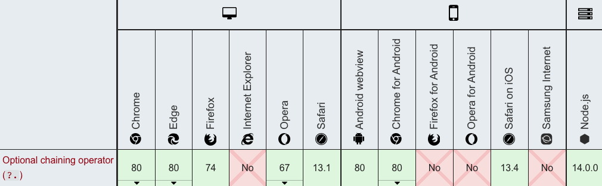

#### [Nullish coalescing operator (??)](https://developer.mozilla.org/zh-CN/docs/Web/JavaScript/Reference/Operators/Nullish_coalescing_operator)

> **空值合并操作符**（**`??`**）是一个逻辑操作符，当左侧的操作数为 [`null`](https://developer.mozilla.org/zh-CN/docs/Web/JavaScript/Reference/Global_Objects/null) 或者 [`undefined`](https://developer.mozilla.org/zh-CN/docs/Web/JavaScript/Reference/Global_Objects/undefined) 时，返回其右侧操作数，否则返回左侧操作数。
>
> 与[逻辑或操作符（`||`）](https://developer.mozilla.org/en-US/docs/Web/JavaScript/Reference/Operators/Logical_Operators#Logical_OR_2)不同，逻辑或操作符会在左侧操作数为[假值](https://developer.mozilla.org/zh-CN/docs/Glossary/Falsy)时返回右侧操作数。也就是说，如果使用 `||` 来为某些变量设置默认值，可能会遇到意料之外的行为。比如为假值（例如，`''` 或 `0`）时。见下面的例子。

- 基本使用

```javascript
const nullValue = null;
const emptyText = ""; // 空字符串，是一个假值，Boolean("") === false
const someNumber = 42;

const valA = nullValue ?? "valA 的默认值";
const valB = emptyText ?? "valB 的默认值";
const valC = someNumber ?? 0;

console.log(valA); // "valA 的默认值"
console.log(valB); // ""（空字符串虽然是假值，但不是 null 或者 undefined）
console.log(valC); // 42
```

- 与 `||`对比

> 由于 || 是一个布尔逻辑运算符，左侧的操作数会被强制转换成布尔值用于求值。任何假值（0， ''， NaN， null， undefined）都不会被返回。这导致如果你使用0，''或NaN作为有效值，就会出现不可预料的后果。

```javascript
let myText = ''; // An empty string (which is also a falsy value)

let notFalsyText = myText || 'Hello world';
console.log(notFalsyText); // Hello world

let preservingFalsy = myText ?? 'Hi neighborhood';
console.log(preservingFalsy); // '' (as myText is neither undefined nor null)
```

- 短路

> 与 OR 和 AND 逻辑操作符相似，当左表达式不为 `null` 或 `undefined` 时，不会对右表达式进行求值。

```javascript
function A() { console.log('函数 A 被调用了'); return undefined; }
function B() { console.log('函数 B 被调用了'); return false; }
function C() { console.log('函数 C 被调用了'); return "foo"; }

console.log( A() ?? C() );
// 依次打印 "函数 A 被调用了"、"函数 C 被调用了"、"foo"
// A() 返回了 undefined，所以操作符两边的表达式都被执行了

console.log( B() ?? C() );
// 依次打印 "函数 B 被调用了"、"false"
// B() 返回了 false（既不是 null 也不是 undefined）
// 所以右侧表达式没有被执行
```

- 不能与 `||` 和 `&&`共用

```javascript
null || undefined ?? "foo"; // 抛出 SyntaxError
true || undefined ?? "foo"; // 抛出 SyntaxError

// 但是，如果使用括号来显式表明运算优先级，是没有问题的：
(null || undefined ) ?? "foo"; // 返回 "foo"
```

- 使用`?.`操作符

```javascript
let customer = {
  name: "Carl",
  details: { age: 82 }
};
let customerCity = customer?.city ?? "暗之城";
console.log(customerCity); // “暗之城”
```

- 兼容性

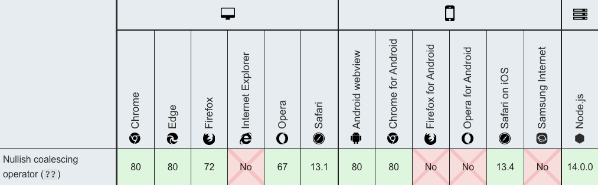


### ES10新特性（2019发布）

#### [Optional `catch` binding（catch 绑定可选）](https://github.com/tc39/proposal-optional-catch-binding)

> 允许在不使用`catch`绑定的情况下省略绑定，`catch` 的参数可以忽略

- 基本使用

```javascript
// 以往
try {
} catch (error) {
}

// 现在支持语法，catch 可以不使用抛出的 error
try {
  // ...
} catch {
  // ...
}
```

- 兼容性

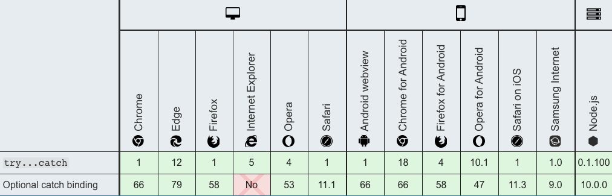

#### [JSON superset（json 超集）](https://github.com/tc39/proposal-json-superset)

> ECMAScript声称JSON是的子集[`JSON.parse`](https://tc39.github.io/ecma262/#sec-json.parse)，但（据充分记载）这是不正确的，因为JSON字符串可以包含未转义的U + 2028 LINE SEPARATOR和U + 2029 PARAGRAPH SEPARATOR字符，而ECMAScript字符串则不能。
>
> JSON语法由[ECMA-404](http://www.ecma-international.org/publications/standards/Ecma-404.htm)定义，并由[RFC 7159](https://tools.ietf.org/html/rfc7159)永久固定，但是ECMA-262的*DoubleStringCharacter*和*SingleStringCharacter*生产可以扩展为允许不转义的U + 2028 LINE SEPARATOR和U + 2029 PARAGRAPH SEPARATOR字符。
>
> 在 ES2019 之前，它会产生错误`SyntaxError: Invalid or unexpected token`

```javascript
const PS = eval("'\u2029'");
```

- 兼容性

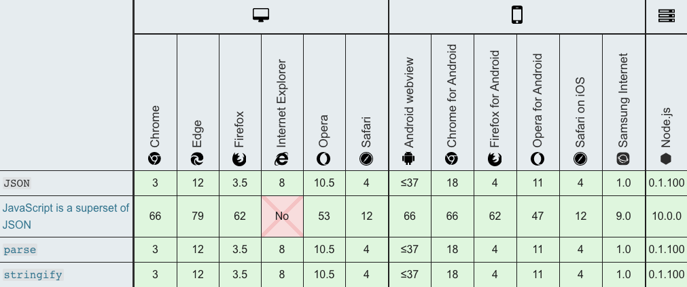

#### [`Symbol.prototype.description`](https://github.com/tc39/proposal-Symbol-description)

> `description` 是一个只读属性，它会返回 [`Symbol`](https://developer.mozilla.org/zh-CN/docs/Web/JavaScript/Reference/Global_Objects/Symbol) 对象的可选描述的字符串。
>
>  对象可以通过一个可选的描述创建，可用于调试，但不能用于访问 symbol 本身。`Symbol.prototype.description` 属性可以用于读取该描述。
>
> 与 `Symbol.prototype.toString()` 不同的是它不会包含 "`Symbol()`" 的字符串。具体请看实例。

- 基本使用

```javascript
Symbol('desc').toString();   // "Symbol(desc)"
Symbol('desc').description;  // "desc"
Symbol('').description;      // ""
Symbol().description;        // undefined

// well-known symbols
Symbol.iterator.toString();  // "Symbol(Symbol.iterator)"
Symbol.iterator.description; // "Symbol.iterator"

// global symbols
Symbol.for('foo').toString();  // "Symbol(foo)"
Symbol.for('foo').description; // "foo"
```

- 兼容性

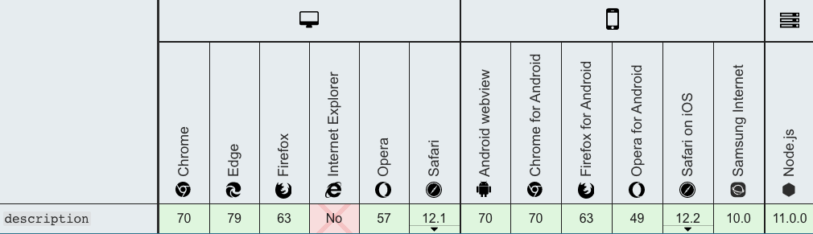

#### [`Function.prototype.toString` 修正](https://github.com/tc39/Function-prototype-toString-revision)

> 返回一个表示当前函数源代码的字符串，修正了返回函数中包含注释（箭头函数除外）

```javascript
function sum /* comments... */(a, b) {
  return a + b;
}
console.log(sum.toString());
// es2019 之前
// function sum (a, b) {
//     return a + b;
// }

// eS2019 之后
// function sum /* comments... */(a, b) {
//     return a + b;
// }

// native code 并不开放
console.log(Math.abs.toString());
// function abs() { [native code] }

// 箭头函数不会包含注释
const arrowFunction /* comment */ = /* comment */ () => {};
console.log(arrowFunction.toString()); // () => {}
```

#### [`Object.fromEntries`](https://github.com/tc39/proposal-object-from-entries)

> `Object.fromEntries(iterable)`方法接收一个键值对的列表参数，并返回一个带有这些键值对的**新对象**。
>
> 参数：`iterable`类似 [`Array`](https://developer.mozilla.org/zh-CN/docs/Web/JavaScript/Reference/Array) 、 [`Map`](https://developer.mozilla.org/zh-CN/docs/Web/JavaScript/Reference/Map) 或者其它实现了[可迭代协议](https://developer.mozilla.org/en-US/docs/Web/JavaScript/Reference/Iteration_protocols#The_iterable_protocol)的可迭代对象。
>
> 返回：一个由该迭代对象条目提供对应属性的新对象。

- 基本使用

```javascript
// Map to Object
const map = new Map([ ['foo', 'bar'], ['baz', 42] ]);
const obj = Object.fromEntries(map);
console.log(obj); // { foo: "bar", baz: 42 }

// Array to Object
const arr = [ ['0', 'a'], ['1', 'b'], ['2', 'c'] ];
const obj = Object.fromEntries(arr);
console.log(obj); // { 0: "a", 1: "b", 2: "c" }
```

- `Object.fromEntries` 是与 [`Object.entries()`](https://developer.mozilla.org/zh-CN/docs/Web/JavaScript/Reference/Global_Objects/Object/entries) 相反的方法

```javascript
const object1 = { a: 1, b: 2, c: 3 };

const object2 = Object.fromEntries(
  Object.entries(object1)
  .map(([ key, val ]) => [ key, val * 2 ])
);

console.log(object2);
// { a: 2, b: 4, c: 6 }
```

- 兼容性

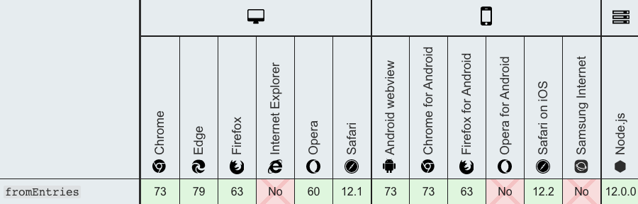

#### [Well-formed `JSON.stringify`](https://github.com/tc39/proposal-well-formed-stringify)

> 防止`JSON.stringify`返回格式错误的Unicode字符串，ES2019 不是将未配对的代理代码点作为单个 UTF-16 代码单元返回，而是用 JSON 转义序列表示它们。

```javascript
// 之前
console.log(JSON.stringify("\uD800")); // "�"

// es2019之后
console.log(JSON.stringify("\uD800")); // "\ud800"
```

#### [`String.prototype.{trimStart,trimEnd}`](https://github.com/tc39/proposal-string-left-right-trim)

> **`trimStart()`** 方法从字符串的开头删除空格。`trimLeft()` 是此方法的别名。方法移除原字符串左端的连续空白符并返回一个新字符串，并不会直接修改原字符串本身。
>
> `trimEnd() `方法从一个字符串的末端移除空白字符。`trimRight()` 是这个方法的别名。方法移除原字符串右端的连续空白符并返回，并不会直接修改原字符串本身。

- 基本使用

```javascript
var str = "   foo  ";

console.log(str.length); // 8

str = str.trimStart()    // 等同于 str = str.trimLeft();
console.log(str.length); // 5
console.log(str);        // "foo  "

var str = "   foo  ";

alert(str.length); // 8

str = str.trimRight();  // 或写成str = str.trimEnd();
console.log(str.length); // 6
console.log(str);       // '   foo'
```

- 兼容性

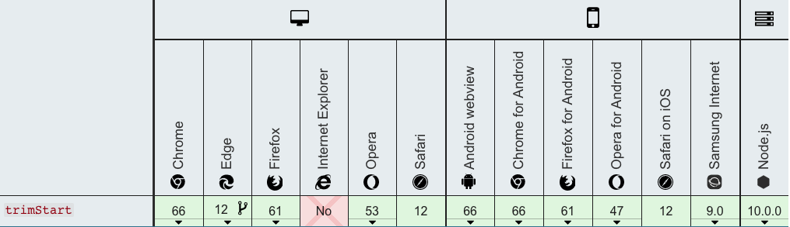

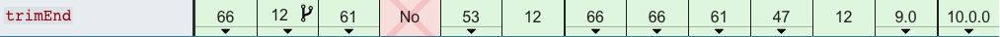

#### [`Array.prototype.{flat,flatMap}`](https://github.com/tc39/proposal-flatMap)

#####  `flat`

> `flat`: 方法会按照一个可指定的深度递归遍历数组，并将所有元素与遍历到的子数组中的元素合并为一个新数组返回。
>
> 语法：`var newArray = arr.flat([depth]`
>
> 入参`depth`(可选)：指定提取嵌套数组的结构深度，默认值为1。
>
> 返回：一个包含将数组与子数组中所有元素的新数组。

- `flat`基本使用

```javascript
var arr1 = [1, 2, [3, 4]];
arr1.flat(); 
// [1, 2, 3, 4]

var arr2 = [1, 2, [3, 4, [5, 6]]];
arr2.flat();
// [1, 2, 3, 4, [5, 6]]

var arr3 = [1, 2, [3, 4, [5, 6]]];
arr3.flat(2);
// [1, 2, 3, 4, 5, 6]

//使用 Infinity，可展开任意深度的嵌套数组
var arr4 = [1, 2, [3, 4, [5, 6, [7, 8, [9, 10]]]]];
arr4.flat(Infinity);
// [1, 2, 3, 4, 5, 6, 7, 8, 9, 10]

// 移除数组中的空项
var arr5 = [1, 2, , 4, 5];
arr5.flat(); // [1, 2, 4, 5]
```

##### `flatMap`

> 方法首先使用映射函数映射每个元素，然后将结果压缩成一个新数组。它与 [map](https://developer.mozilla.org/en-US/docs/Web/JavaScript/Reference/Global_Objects/Array/map) 连着深度值为1的 [flat](https://developer.mozilla.org/en-US/docs/Web/JavaScript/Reference/Global_Objects/Array/flat) 几乎相同，但 `flatMap` 通常在合并成一种方法的效率稍微高一些。

- 语法

```javascript
/**
	参数：
	  callback
			可以生成一个新数组中的元素的函数，可以传入三个参数：
			currentValue
				当前正在数组中处理的元素
			index可选
				可选的。数组中正在处理的当前元素的索引。
			array可选
				可选的。被调用的 map 数组
		thisArg可选
			可选的。执行 callback 函数时 使用的this 值。
			
	返回： 一个新的数组，其中每个元素都是回调函数的结果，并且结构深度 depth 值为1。		
 */
var new_array = arr.flatMap(function callback(currentValue[, index[, array]]) {
    // return element for new_array
}[, thisArg])
```

- 基本使用

```javascript
var arr1 = [1, 2, 3, 4];

arr1.map(x => [x * 2]); 
// [[2], [4], [6], [8]]

arr1.flatMap(x => [x * 2]);
// [2, 4, 6, 8]

// 只有一层 flattened
arr1.flatMap(x => [[x * 2]]);
// [[2], [4], [6], [8]]
```

##### 兼容性

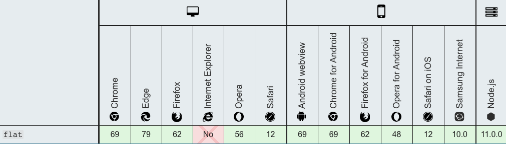

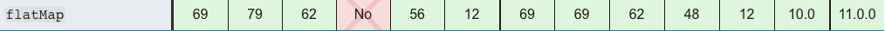

### ES9新特性（2018发布）

#### [非法转义序列的修订（Lifting template literal restriction）](https://github.com/tc39/proposal-template-literal-revision)

> #### ES2018关于非法转义序列的修订:
>
> 带标签的模版字符串应该允许嵌套支持常见转义序列的语言（例如[DSLs](https://en.wikipedia.org/wiki/Domain-specific_language)、[LaTeX](https://en.wikipedia.org/wiki/LaTeX)）。ECMAScript提议[模版字面量修订](https://tc39.github.io/proposal-template-literal-revision/)(第4阶段，将要集成到ECMAScript 2018标准) 移除对ECMAScript在带标签的模版字符串中转义序列的语法限制。

```javascript
function latex(str) { 
 return { "cooked": str[0], "raw": str.raw[0] }
} 

latex`\unicode`

// 较老版本 es2016或更早
// SyntaxError: malformed Unicode character escape sequence

// es2018
// { cooked: undefined, raw: "\\unicode" }
```

- 值得注意的是，这一转义序列限制只对带标签的模板字面量移除，而不包括不带标签的模板字面量：

```javascript
let bad = `bad escape sequence: \unicode`; // 报错 Uncaught SyntaxError: Invalid Unicode escape sequence
```

#### [正则表达式`\s` or (`dotAll`) ](https://github.com/tc39/proposal-regexp-dotall-flag)

> 正则表达式中点`.`匹配除回车外的任何单字符，标记`s`改变这种行为，允许行终止符的出现.

```javascript
/foo.bar/.test('foo\nbar');
// → false

/foo.bar/s.test('foo\nbar');
// → true
```

- `dotAll`：**`dotAll`** 属性表明是否在正则表达式中一起使用"`s`"修饰符（引入/s修饰符，使得.可以匹配任意单个字符）。`dotAll` 是一个只读的属性，属于单个正则表达式实例。

```javascript
const re = /foo.bar/s; // Or, `const re = new RegExp('foo.bar', 's');`.
re.test('foo\nbar');
// → true
re.dotAll
// → true
re.flags
// → 's'
```

- 兼容性

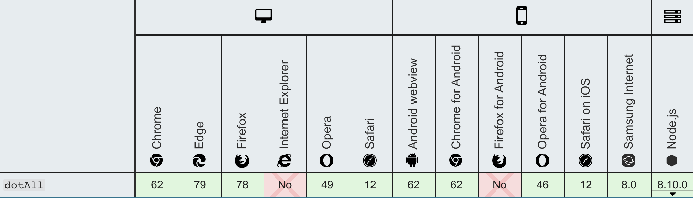

#### [正则表达式命名捕获组（RegExp named capture groups）](https://github.com/tc39/proposal-regexp-named-groups)

> ES2018允许命名捕获组使用符号`?<name>`，在打开捕获括号`(`后立即命名，示例如下：
>
> 任何匹配失败的命名组都将返回`undefined`。

- `exec`

```javascript
let re = /(?<year>\d{4})-(?<month>\d{2})-(?<day>\d{2})/u;
let result = re.exec('2015-01-02');
// result.groups.year === '2015';
// result.groups.month === '01';
// result.groups.day === '02';

// result[0] === '2015-01-02';
// result[1] === '2015';
// result[2] === '01';
// result[3] === '02';
```

- `replace`

```javascript
let re = /(?<year>\d{4})-(?<month>\d{2})-(?<day>\d{2})/u;
let result = '2015-01-02'.replace(re, '$<day>/$<month>/$<year>');
// result === '02/01/2015'
```

#### [Rest/Spread Properties](https://github.com/tc39/proposal-object-rest-spread)

> ES2015引入了[Rest参数](https://developer.mozilla.org/zh-CN/docs/Web/JavaScript/Reference/Functions/Rest_parameters)和[扩展运算符](https://developer.mozilla.org/zh-CN/docs/Web/JavaScript/Reference/Operators/Spread_syntax)。三个点（...）仅用于数组。Rest参数语法允许我们将一个不定数量的参数表示为一个数组。

```javascript
// es2015 
restFunc(1, 2, 3, 4, 5);

function restFunc(arg1, arg2, ...arg3) {
  // arg1 = 1
  // arg2 = 2
  // arg3 = [3, 4, 5]
}

// 展开属性
const arr = [1, 4, -1, 5, 9];
console.log(Math.max(...values)); // 9
```

> ES2018为对象解构提供了和数组一样的Rest参数和(...)展开操作符

- rest 属性

```javascript
let { x, y, ...z } = { x: 1, y: 2, a: 3, b: 4 };
x; // 1
y; // 2
z; // { a: 3, b: 4 }
```

- 展开 属性

```javascript
let n = { x, y, ...z };
n; // { x: 1, y: 2, a: 3, b: 4 }
```

#### [RegExp反向断言（RegExp Lookbehind Assertions）](https://github.com/tc39/proposal-regexp-lookbehind)

- 正向断言（`?<=...`），它们确保包含在其中的模式位于声明之后的模式之前

```javascript
// 匹配金额
/(?<=\$)\d+(\.\d*)?/.exec('$10.53');
// [10.53 ...]
/(?<=\$)\d+(\.\d*)?/.exec('￥10.53');
// null
```

- 反向断言（`?<!...`），另一方面，请确保其中的模式不在该断言之后的模式之前

```javascript
/(?<!\$)\d+(?:\.\d*)/.exec('$10.53')
// [0.53 ...]

/(?<!\$)\d+(?:\.\d*)/.exec('￥10.53')
// [10.53 ...]
```

#### [Unicode属性在正则表达式中转义（RegExp Unicode Property Escapes）](https://github.com/tc39/proposal-regexp-unicode-property-escapes)

> es2018之前，在正则表达式中本地访问 Unicode 字符属性是不被允许的。
>
> ES2018添加了 Unicode 属性转义——形式为`\p{...}`和`\P{...}`，在正则表达式中使用标记 `u` (unicode) 设置，在`\p`块儿内，可以以键值对的方式设置需要匹配的属性而非具体内容。

```javascript
const regex = /^\p{Decimal_Number}+$/u;
regex.test('𝟏𝟐𝟑𝟜𝟝𝟞𝟩𝟪𝟫𝟬𝟭𝟮𝟯𝟺𝟻𝟼');
// → true

const regex = /^\P{Decimal_Number}+$/u;
regex.test('Իմ օդաթիռը լի է օձաձկերով');
// → true

const regex = /^\p{Number}+$/u;
regex.test('²³¹¼½¾𝟏𝟐𝟑𝟜𝟝𝟞𝟩𝟪𝟫𝟬𝟭𝟮𝟯𝟺𝟻𝟼㉛㉜㉝ⅠⅡⅢⅣⅤⅥⅦⅧⅨⅩⅪⅫⅬⅭⅮⅯⅰⅱⅲⅳⅴⅵⅶⅷⅸⅹⅺⅻⅼⅽⅾⅿ');
// → true
```

#### [`Promise.prototype.finally`](https://github.com/tc39/proposal-promise-finally)

> `finally()` 方法返回一个[`Promise`](https://developer.mozilla.org/zh-CN/docs/Web/JavaScript/Reference/Global_Objects/Promise)。在promise结束时，无论结果是fulfilled或者是rejected，都会执行指定的回调函数。这为在`Promise`是否成功完成后都需要执行的代码提供了一种方式。
>
> 这避免了同样的语句需要在[`then()`](https://developer.mozilla.org/zh-CN/docs/Web/JavaScript/Reference/Global_Objects/Promise/then)和[`catch()`](https://developer.mozilla.org/zh-CN/docs/Web/JavaScript/Reference/Global_Objects/Promise/catch)中各写一次的情况。
>
> **注意:** 在`finally`回调中 `throw`（或返回被拒绝的promise）将以 `throw()` 指定的原因拒绝新的promise.

- `finally()` 虽然与 `.then(onFinally, onFinally)` 类似，它们不同的是:
  - 调用内联函数时，不需要多次声明该函数或为该函数创建一个变量保存它。
  - 由于无法知道`promise`的最终状态，所以`finally`的回调函数中不接收任何参数，它仅用于无论最终结果如何都要执行的情况。
  - 与`Promise.resolve(2).then(() => {}, () => {})` （resolved的结果为`undefined`）不同，`Promise.resolve(2).finally(() => {})` resolved的结果为 `2`。
  - 同样，`Promise.reject(3).then(() => {}, () => {})` (resolved 的结果为`undefined`), `Promise.reject(3).finally(() => {})` rejected 的结果为 `3`。
- 基本使用

```javascript
let isLoading = true;

fetch(myRequest).then(function(response) {
    var contentType = response.headers.get("content-type");
    if(contentType && contentType.includes("application/json")) {
      return response.json();
    }
    throw new TypeError("Oops, we haven't got JSON!");
  })
  .then(function(json) { /* process your JSON further */ })
  .catch(function(error) { console.log(error); })
  .finally(function() { isLoading = false; });
```

- 兼容性


#### [异步迭代器（Asynchronous Iteration）](https://github.com/tc39/proposal-async-iteration)

> es2018引入异步迭代器`for-await-of`，使得`await`可以和`for...of`循环一起使用，以串行的方式运行异步操作。
>
> **`for await...of` 语句**会在异步或者同步可迭代对象上创建一个迭代循环，包括 [`String`](https://developer.mozilla.org/zh-CN/docs/Web/JavaScript/Reference/String)，[`Array`](https://developer.mozilla.org/zh-CN/docs/Web/JavaScript/Reference/Array)，`Array`-like 对象（比如[`arguments`](https://developer.mozilla.org/zh-CN/docs/Web/JavaScript/Reference/Functions/arguments) 或者[`NodeList`](https://developer.mozilla.org/zh-CN/docs/Web/API/NodeList))，[`TypedArray`](https://developer.mozilla.org/zh-CN/docs/Web/JavaScript/Reference/Global_Objects/TypedArray)，[`Map`](https://developer.mozilla.org/zh-CN/docs/Web/JavaScript/Reference/Map)， [`Set`](https://developer.mozilla.org/zh-CN/docs/Web/JavaScript/Reference/Global_Objects/Set)和自定义的异步或者同步可迭代对象。其会调用自定义迭代钩子，并为每个不同属性的值执行语句**。**像[`await`](https://developer.mozilla.org/zh-CN/docs/Web/JavaScript/Reference/await)表达式一样，这个语句只能在 [async function](https://developer.mozilla.org/zh-CN/docs/Web/JavaScript/Reference/Statements/async_function)内使用。

- es2018之前，错误场景案例

> 在`async/await`的某些时刻，你可能尝试在同步循环中调用异步函数。

```javascript
// 以下方法循环本身依旧同步，并且会在内部异步函数完成之前全部调用完成
async function process(array) {
  for (let i of array) {
    await doSomething(i);
  }
}
async function process(array) {
  array.forEach(async i => {
    await doSomething(i);
  });
}
```

- 基本使用

```javascript
async function process(array) {
  for await (let i of array) {
    doSomething(i);
  }
}
```

- 迭代异步可迭代对象

```javascript
var asyncIterable = {
  [Symbol.asyncIterator]() {
    return {
      i: 0,
      next() {
        if (this.i < 3) {
          return Promise.resolve({ value: this.i++, done: false });
        }

        return Promise.resolve({ done: true });
      }
    };
  }
};

(async function() {
   for await (num of asyncIterable) {
     console.log(num);
   }
})();

// 0
// 1
// 2
```

- 迭代异步生成器

```js
async function* asyncGenerator() {
  var i = 0;
  while (i < 3) {
    yield i++;
  }
}

(async function() {
  for await (num of asyncGenerator()) {
    console.log(num);
  }
})();
// 0
// 1
// 2
```

- 兼容性

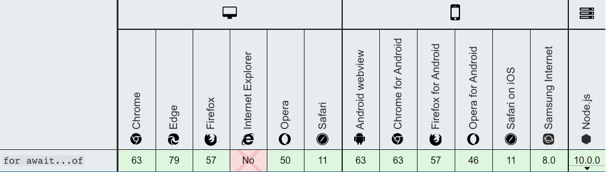

### ES8新特性（2017发布）

#### [`Object.values`/`Object.entries`](https://github.com/tc39/proposal-object-values-entries)

- `Object.values`

> `Object.values()`方法返回一个给定对象自身的所有可枚举属性值的数组，值的顺序与使用[`for...in`](https://developer.mozilla.org/zh-CN/docs/Web/JavaScript/Reference/Statements/for...in)循环的顺序相同 ( 区别在于 for-in 循环枚举原型链中的属性 )。

- `Object.entries`

> `Object.entries()方法返回一个给定对象自身可枚举属性的键值对数组，其排列与使用 [`for...in`](https://developer.mozilla.org/zh-CN/docs/Web/JavaScript/Reference/Statements/for...in) 循环遍历该对象时返回的顺序一致（区别在于 for-in 循环还会枚举原型链中的属性）。

- 基本使用

```javascript
var obj = { foo: 'bar', baz: 42 };
console.log(Object.values(obj)); // ['bar', 42]
console.log(Object.entries(obj)); // [ ['foo', 'bar'], ['baz', 42] ]
```

- 兼容性

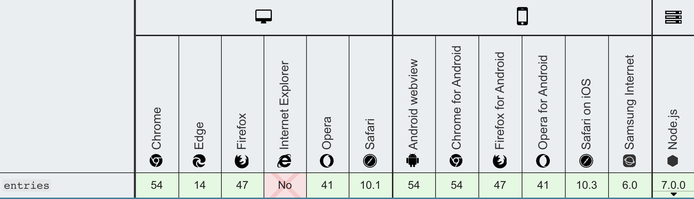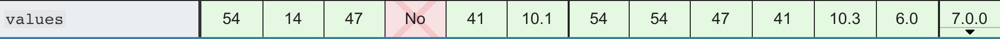

#### [String padding](https://github.com/tc39/proposal-string-pad-start-end)

- `String.prototype.padStart`

> **`padStart()`** 方法用另一个字符串填充当前字符串(如果需要的话，会重复多次)，以便产生的字符串达到给定的长度。从当前字符串的左侧开始填充。

- `String.prototype.padEnd`

> **`padEnd()`** 方法会用一个字符串填充当前字符串（如果需要的话则重复填充），返回填充后达到指定长度的字符串。从当前字符串的末尾（右侧）开始填充。

- 语法

```javascript
/** 
	* 参数
	* 
	* targetLength：当前字符串需要填充到的目标长度。如果这个数值小于当前字符串的长度，则返回当前字符串本身。
 	* padString(可选)：填充字符串。如果字符串太长，使填充后的字符串长度超过了目标长度，则只保留最左侧的部分，其他部分会被截断。此参数的缺省值为 " "（U+0020）。
 	*/
str.padStart(targetLength [, padString])
str.padEnd(targetLength [, padString])
```

- 基本使用

```javascript
'abc'.padStart(10);         // "       abc"
'abc'.padStart(10, "foo");  // "foofoofabc"
'abc'.padStart(6,"123465"); // "123abc"
'abc'.padStart(8, "0");     // "00000abc"
'abc'.padStart(1);          // "abc"

'abc'.padEnd(10);          // "abc       "
'abc'.padEnd(10, "foo");   // "abcfoofoof"
'abc'.padEnd(6, "123456"); // "abc123"
'abc'.padEnd(1);           // "abc"
```

- 兼容性

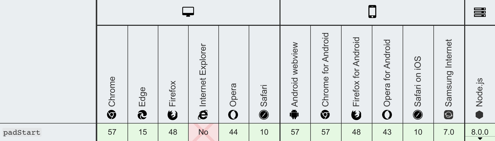


#### [`Object.getOwnPropertyDescriptors`](https://github.com/tc39/proposal-object-getownpropertydescriptors)

> `Object.getOwnPropertyDescriptors()` 方法用来获取一个对象的所有自身属性的描述符。
>
> 入参：任意对象
>
> 返回：所指定对象的所有自身属性的描述符，如果没有任何自身属性，则返回空对象。

- 基本使用

```javascript
// Object.assign() 方法只能拷贝源对象的可枚举的自身属性，同时拷贝时无法拷贝属性的特性们，而且访问器属性会被转换成数据属性，也无法拷贝源对象的原型，该方法配合 Object.create() 方法可以实现上面说的这些。
Object.create(
  Object.getPrototypeOf(obj), 
  Object.getOwnPropertyDescriptors(obj) 
);
```

- 兼容性

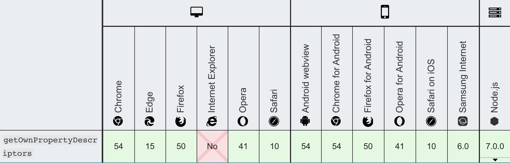

#### [函数/参数列表中允许逗号结尾（Trailing commas in function parameter lists and calls）](https://github.com/tc39/proposal-trailing-function-commas)

> 在对由版本控制系统管理的代码（git，subversion，mercurial等）进行此更改的过程中，第3行和第9行的非常规/注释代码历史记录信息将更新为指向添加逗号的人（而是而不是最初添加参数的人）。

```javascript
1: function clownPuppiesEverywhere(
 2:   param1,
 3:   param2, // updated to add a comma
 4:   param3  // updated to add new parameter
 5: ) { /* ... */ }
 6: 
 7: clownPuppiesEverywhere(
 8:   'foo',
 9:   'bar', // updated to add a comma
10:   'baz'  // updated to add new parameter
11: );
```

> 为了帮助缓解此问题，某些其他语言（Python，D，Hack等……可能还有其他……）添加了语法支持，以允许在这些参数列表中使用逗号结尾。这使代码提供者可以始终在这些每行参数列表之一中以尾随逗号结束参数添加，而不必担心代码归因问题

```javascript
 1: function clownPuppiesEverywhere(
 2:   param1,
 3:   param2, // Next parameter that's added only has to add a new line, not modify this line
 5: ) { /* ... */ }
 6: 
 7: clownPuppiesEverywhere(
 8:   'foo',
 9:   'bar', // Next parameter that's added only has to add a new line, not modify this line
11: );
```

> 注意，该建议仅与语法有关，并且不对语义进行任何更改，因此尾随逗号的存在对诸如之类的东西没有影响`<<function>>.length`。

#### [Async functions](https://github.com/tc39/ecmascript-asyncawait)

> async函数是使用`async`关键字声明的函数。 async函数是[`AsyncFunction`](https://developer.mozilla.org/zh-CN/docs/Web/JavaScript/Reference/Global_Objects/AsyncFunction)构造函数的实例， 并且其中允许使用`await`关键字。`async`和`await`关键字让我们可以用一种更简洁的方式写出基于[`Promise`](https://developer.mozilla.org/zh-CN/docs/Web/JavaScript/Reference/Global_Objects/Promise)的异步行为，而无需刻意地链式调用`promise`。
>
> async函数可能包含0个或者多个[`await`](https://developer.mozilla.org/zh-CN/docs/Web/JavaScript/Reference/Operators/await)表达式。await表达式会暂停整个async函数的执行进程并出让其控制权，只有当其等待的基于promise的异步操作被兑现或被拒绝之后才会恢复进程。promise的解决值会被当作该await表达式的返回值。使用`async` / `await`关键字就可以在异步代码中使用普通的`try` / `catch`代码块。
>
> `await`关键字只在async函数内有效。如果你在async函数体之外使用它，就会抛出语法错误 [`SyntaxError`](https://developer.mozilla.org/zh-CN/docs/Web/JavaScript/Reference/Global_Objects/SyntaxError) 。
>
> `async`/`await`的目的为了简化使用基于promise的API时所需的语法。`async`/`await`的行为就好像搭配使用了生成器和promise。

- 基本使用

```javascript
async function foo() {
   return 1
}
// 相当于
function foo() {
   return Promise.resolve(1)
}

// async函数的函数体可以被看作是由0个或者多个await表达式分割开来的。
// 从第一行代码直到（并包括）第一个await表达式（如果有的话）都是同步运行的。
// 这样的话，一个不含await表达式的async函数是会同步运行的。
// 然而，如果函数体内有一个await表达式，async函数就一定会异步执行。
async function foo() {
   await 1
}
// 等价于
function foo() {
   return Promise.resolve(1).then(() => undefined)
}
```

- 兼容性

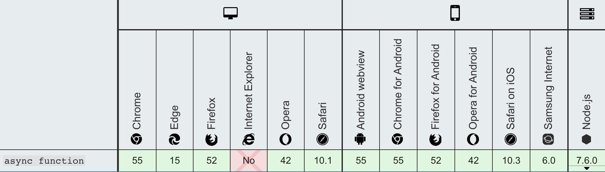

#### [`共享内存`和`Atomics`（Shared memory and atomics）](https://github.com/tc39/ecmascript_sharedmem)

> `共享内存`和`Atomics`：引入了一个新的构造函数 `SharedArrayBuffer` 和 具有辅助函数的命名空间对象 `Atomics`

- **`SharedArrayBuffer`** 对象用来表示一个通用的，固定长度的原始二进制数据缓冲区，类似于 [`ArrayBuffer`](https://developer.mozilla.org/zh-CN/docs/Web/JavaScript/Reference/Global_Objects/ArrayBuffer) 对象，它们都可以用来在共享内存（shared memory）上创建视图。与 `ArrayBuffer` 不同的是，`SharedArrayBuffer` 不能被分离。

>  为了将一个[`SharedArrayBuffer`](https://developer.mozilla.org/zh-CN/docs/Web/JavaScript/Reference/Global_Objects/SharedArrayBuffer) 对象从一个用户代理共享到另一个用户代理（另一个页面的主进程或者当前页面的一个 `worker` ）从而实现共享内存，我们需要运用 `postMessage` 和结构化克隆算法（ [structured cloning](https://developer.mozilla.org/en-US/docs/Web/API/Web_Workers_API/Structured_clone_algorithm) ）。
>
>  `结构化克隆算法`接收被映射到一个新的 `SharedArrayBuffers` 对象上的 `SharedArrayBuffers` 对象与 `TypedArrays` 对象。在这两种映射下，这个新的 `SharedArrayBuffer` 对象会被传递到目标用户代理的接收函数上，导致在目标用户代理产生了一个新的私有 `SharedArrayBuffer` 对象（正如 [`ArrayBuffer`](https://developer.mozilla.org/zh-CN/docs/Web/JavaScript/Reference/Global_Objects/ArrayBuffer) 一样）。然而，这两个 `SharedArrayBuffer` 对象指向的共享数据块其实是同一个，并且在某一代理中的一个块的副作用将最终导致另一个代理具有可见性。

- **`Atomics`** 对象提供了一组静态方法对 [`SharedArrayBuffer`](https://developer.mozilla.org/zh-CN/docs/Web/JavaScript/Reference/Global_Objects/SharedArrayBuffer) 和  [`ArrayBuffer`](https://developer.mozilla.org/zh-CN/docs/Web/JavaScript/Reference/Global_Objects/ArrayBuffer) 对象进行原子操作。

> 这些原子操作属于 `Atomics` 模块。与一般的全局对象不同，`Atomics` 不是构造函数，因此不能使用 [new](https://developer.mozilla.org/zh-CN/docs/Web/JavaScript/Reference/Operators/new) 操作符调用，也不能将其当作函数直接调用。`Atomics` 的所有属性和方法都是静态的（与 [`Math`](https://developer.mozilla.org/zh-CN/docs/Web/JavaScript/Reference/Global_Objects/Math) 对象一样）。

### ES7新特性（2016发布）

#### [`Array.prototype.includes`](https://github.com/tc39/Array.prototype.includes)

> `includes()` 方法用来判断一个数组是否包含一个指定的值，根据情况，如果包含则返回 true，否则返回false。

- 语法

```javascript
/**
	* valueToFind：需要查找的元素值。
	* fromIndex（可选）：从fromIndex 索引处开始查找 valueToFind。如果为负值，则按升序从 array.length + fromIndex 的索引开始搜 （即使从末尾开始往前跳 fromIndex 的绝对值个索引，然后往后搜寻）。默认为 0。
	* 返回：返回一个布尔值 Boolean ，如果在数组中找到了（如果传入了 fromIndex ，表示在 fromIndex 指定的索引范围中找到了）则返回 true 。
	*/
arr.includes(valueToFind[, fromIndex])
```

- 基本使用

```javascript
[1, 2, 3].includes(2);     // true
[1, 2, 3].includes(4);     // false
[1, 2, 3].includes(3, 3);  // false
[1, 2, 3].includes(3, -1); // true
[1, 2, NaN].includes(NaN); // true
```

- 如果 `fromIndex `为负值，计算出的索引将作为开始搜索`searchElement`的位置。如果计算出的索引小于 0，则整个数组都会被搜索。

```javascript
// 计算索引小于0
// array length is 3
// fromIndex is -100
// computed index is 3 + (-100) = -97
var arr = ['a', 'b', 'c'];

arr.includes('a', -100); // true
arr.includes('b', -100); // true
arr.includes('c', -100); // true
arr.includes('a', -2); // false
```

- 兼容性

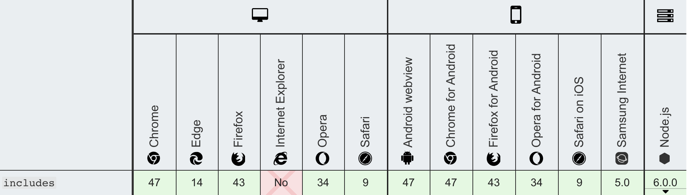

#### [求幂 (**)（Exponentiation operator）](https://github.com/tc39/proposal-exponentiation-operator)

> 求幂运算符（`**`）返回将第一个操作数加到第二个操作数的幂的结果。它等效于`Math.pow`，不同之处在于它也接受BigInts作为操作数。
>
> 求幂运算符是是**右结合的**: `a ** b ** c` 等于 `a ** (b ** c)`.

- 基本使用

```javascript
2 ** 3   // 8
3 ** 2   // 9
3 ** 2.5 // 15.588457268119896
10 ** -1 // 0.1
NaN ** 2 // NaN

// 右结合性
2 ** 3 ** 2   // 512
2 ** (3 ** 2) // 512
(2 ** 3) ** 2 // 64

// 与一元运算符结合
-(2 ** 2) // -4
(-2) ** 2 // 4
```

- 在JavaScript里，你不可能写出一个不明确的求幂表达式。这就是说，你不能立刻将一个一元运算符（`+/-/~/!/delete/void/typeof`）放在基数前，这样做只会导致一个语法错误。

```javascript
-2 ** 2; 
// 4 in Bash, -4 in other languages. 
// This is invalid in JavaScript, as the operation is ambiguous. 

-(2 ** 2); 
// -4 in JavaScript and the author's intention is unambiguous. 
```

- 兼容性

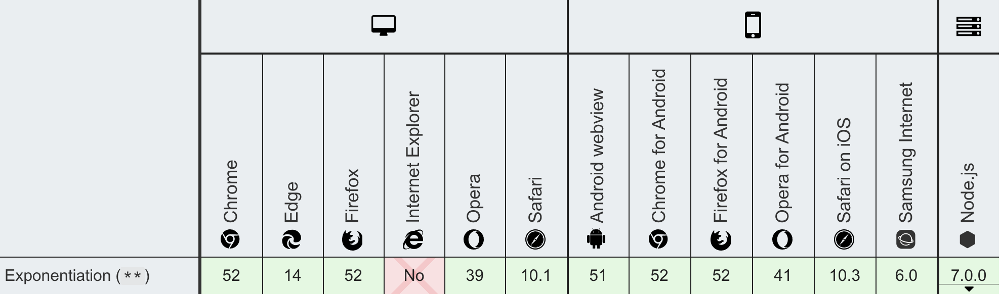


### 参考
- [TC39](https://github.com/tc39/proposals/blob/master/finished-proposals.md)
- [MDN](https://developer.mozilla.org/zh-CN/docs/Web/JavaScript)