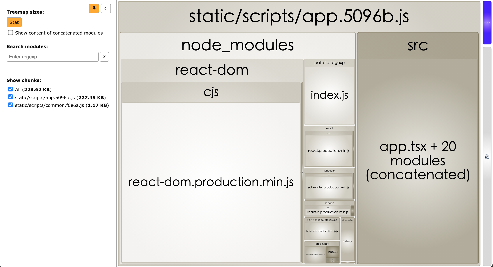
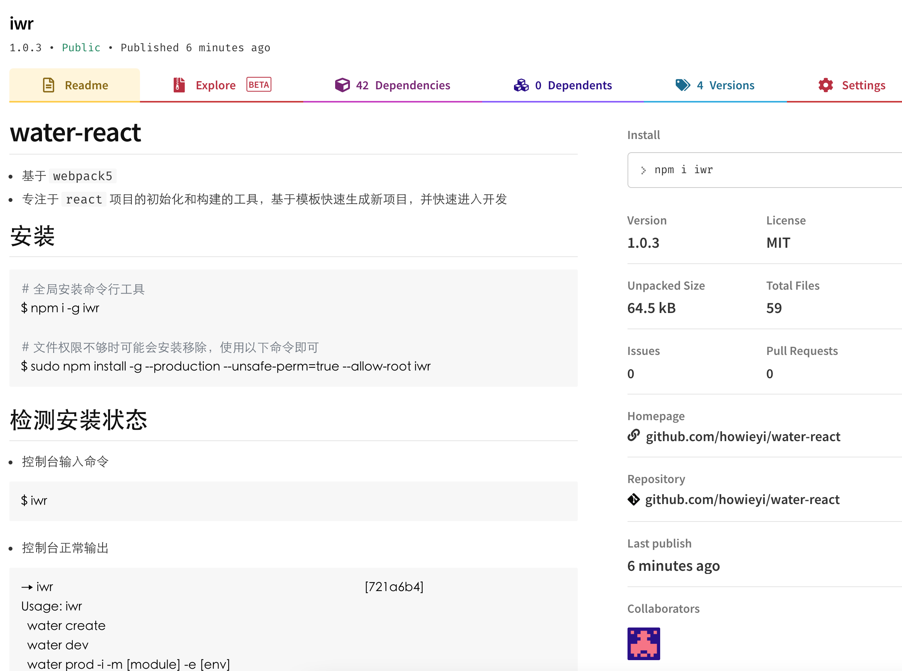
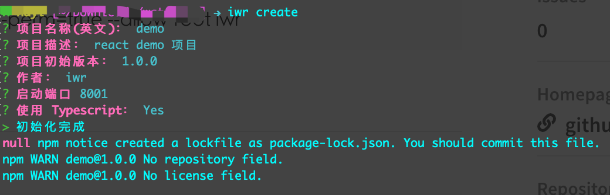
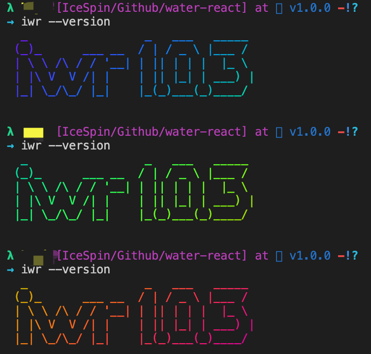

## 你只管开心写业务，其他的交给我来

### 吐槽点

- 每次开新项目都挺痛苦的
- 项目搭建（项目结构、组件、公共样式、打包、构建）找到老项目复制粘贴、删除、改造什么的也太 low 了，
- 再想要改造升级什么的，所有项目都得再撸一遍什么的麻烦死了，倒不如自己折腾一个脚手架体系来摆脱这些不必要的麻烦 
- 还有一点就是，以后做接点私活啥的的真的是太合适了，哈哈哈
- 代码在这里，@[water-react](https://github.com/howieyi/water-react)

### 要解决什么痛点？

- 再也不用复制粘贴什么的了
- 项目模板统一管理
- 构建流程统一了，构建产物也规范了
- 专心写业务，框架什么的干一次就行了
- 团队想积累点东西直接通过扩展脚手架即可方便扩展

### cli 打算做什么?

- 怎么着需要一个项目初始化的功能吧，不然要它做甚
- 初始化啥呢，这时候就需要定制模板了，对，做几套通用模板
- 项目初始化完事后呢，项目总需要跑起来吧，这时候就需要构建了
- 构建么，webpack、snowpack、rollup 什么的大家都不陌生吧，基本也就走这个路子了，选一个喜欢的，开启定制
- 开发环境构建、生产环境构建、包依赖分析什么的是必备功能了

### 要如何做呢？

1. 实现 cli 脚本雏形

- 利用 `package.json` 中的 `bin` 属性来指定各个内部命令对应的可执行文件的位置

> node 体系内天然支持映射脚本的功能

```json
{
  "name": "iwr",
  "version": "1.0.1",
  "description": "基于 react 的 cli 脚手架构建工具",
  "bin": {
    "iwr": "bin/iwr.js"
  },
  "homepage": "https://github.com/howieyi/water-react",
  "author": "水逆<huyi247767221@163.com>",
  "license": "MIT"
}
```

- `bin/iwr.js`，这时候就需要编写脚本内容了

```javascript
// 这一行很关键，是告知系统通过环境变量中的 node 来执行该脚本
#!/usr/bin/env node

// commander 是一个命令行处理工具，用作定义和处理命令以及其参数
const program = require("commander");
const version = require('../package').version;

program
  .version(version)
  .usage(
    `  
  water create
  water dev
  water prod -i -a [analyzerPort]
  water umd -i`
  )
  .description(
    `Params:
  
  dev:
    -i 是否打印详细信息
  
  prod: 
    -i 是否打印详细信息
    -a [analyzerPort] 是否开启代码依赖分析（默认端口8989）

  umd:
    -i 是否打印详细信息  
    `
  )
  .command('create', '初始化项目')
  .command('dev', '开发环境构建')
  .command('prod', '生产环境构建')
  .command('umd', '公共包构建');

program.parse(process.argv);
```

2. 实现自定义模板雏形
- 模板肯定是基于历史项目，抽离共性，拆出来一套公共代码
- 需要自定义一个配置文件用来告知脚本项目相关的配置，比如定义主目录、编译目录、alias 映射目录等
> 这里比较灵活，根据需要自定义扩展
- 这里给出一个范例 `iwr.config.js`
```javascript
const proxyMapping = {};

// 接口前缀
const apiPrefix = 'https://api.test.example.com';

// 接口 uri 前缀
const uriPrefix = ['/api'];

// 代理映射
uriPrefix.forEach(uri => {
  proxyMapping[uri] = {
    target: apiPrefix,
    changeOrigin: true,
    secure: false,
    pathRewrite: {
      [`^${uri}`]: apiPrefix + uri,
    },
  };
});

module.exports = {
  // 自定义端口
  port: '3001',
  // 项目根目录
  resolvePath: './src',
  // 构建主路径
  publicPath: '/',
  // 构建产物目录
  buildPath: './dist',
  // 默认迁移文件目录
  copyPath: './src/assets/public',
  // 接口代理
  proxy: proxyMapping,
  // 是否支持 markdown 转义
  markdown: false,
};

```

3. 基于模板实现构建
> 这里选的是 webpack5 去实现的构建

- 代码在这里，@[water-react](https://github.com/howieyi/water-react)
- 开发模式，实现开发构建，hrm/sourceMap/scss/ts 啥的都是必备的

> 这里直接调用 webpack-dev-server，晒一下主要代码，主要思想是根据上面的配置文件来构建代码，webpack 配置啥的就不再赘述了，相信大家都比较熟悉了

```javascript
// 获取主配置
const webpackConfig = require(`../webpack/build/webpack.dev.js`)({
  ...appConfig,
});

const webpack = require("webpack");
const WebpackDevServer = require("webpack-dev-server");

try {
  const devServerConfig = webpackConfig.devServer;
  // 直接调用 webpack-dev-server
  const server = new WebpackDevServer(webpack(webpackConfig), devServerConfig);
  // 开启监听
  server.listen(devServerConfig.port, devServerConfig.host, err => {
    if (err) {
      throw err;
    }
  });
} catch (error) {
  console.error(error);
  process.exit(-1);
}
```

- 生产模式，生产环境构建打包了
> 贴一段主要代码
```javascript
const webpack = require("webpack");

// 获取主配置
webpackConfig = require(`../webpack/build/webpack.prod.js`)({
  ...appConfig,
});

const buildStamp = Date.now();

// 直接调用 webpack
webpack(webpackConfig, async (err, stats) => {
  if (err || stats.hasErrors()) {
    if (err) {
      console.error(red(err.stack || err));
      err.details && console.error(red(err.details));
      return;
    }

    stats.hasErrors() && console.error(stats.toString({ colors: true, chunks: false }));

    console.log("\n> 构建异常 \n");
  } else {
    isInfo && console.warn(stats.toString({ colors: true, chunks: false }));

    console.log(`\n> 构建完成，耗时 ${Date.now() - buildStamp} ms`);
  }
});
```

4. 分析包依赖，进一步优化模板
> 基于生产构建环节，增加了 `webpack-bundle-analyzer` 分析包依赖的操作


5. 交互命令行实现初始化项目
> 这里需要用到 [inquirer](https://www.npmjs.com/package/inquirer) 这个包，专门提供命令行交互的工具

```javascript
#!/usr/bin/env node

const { join } = require('path');
// 交互命令行工具
const { prompt } = require('inquirer');
const chalk = require('chalk');
const { exec } = require('child_process');

const { copyFolder } = require('../webpack/utils/file');

const developPath = process.cwd();
const iwrPath = join(__dirname, '..');
const templatePathPrefix = 'template';

// 1. 自定义选项
prompt([
  {
    type: 'input',
    name: 'name',
    message: '项目名称(英文)：',
    default: 'water-ui',
  },
  {
    type: 'input',
    name: 'description',
    message: '项目描述：',
    default: 'react 项目',
  },
  {
    type: 'input',
    name: 'version',
    message: '项目初始版本：',
    default: '1.0.0',
  },
  {
    type: 'input',
    name: 'author',
    message: '作者：',
    default: 'iwr',
  },
  {
    type: 'input',
    name: 'port',
    message: '启动端口',
    default: '8001',
  },
  {
    type: 'confirm',
    name: 'typescript',
    message: '使用 Typescript：',
    default: 'Y',
  },
])
  .then(options => {
    const { name, typescript } = options;

    const templateName = `react${typescript ? '-ts' : ''}`;
    const templatePath = join(iwrPath, templatePathPrefix, templateName);
    const toPath = join(developPath, name);

    // 2. 复制项目模板，并替换自定义内容
    copyFolder(templatePath, toPath, options);
    console.log(chalk.green('> ') + '初始化完成');

    // 3. 执行 npm i 脚本
    exec(`cd ${name} && npm i`, (err, stdout, stderr) => {
      if (err || stderr) {
        console.log(err, stderr);
        process.exit(-1);
      } else {
        console.log(stdout);
      }
    });
  })
  .catch(error => {
    if (error.isTtyError) {
      console.error('当前环境暂不支持');
      // Prompt couldn't be rendered in the current environment
    } else {
      // Something else when wrong
      console.error(error);
    }
  });
```
> 以上其实可以有更多发挥和扩展空间，看项目需要，代码在这里，@[water-react](https://github.com/howieyi/water-react)

6. 发布到 npm

```bash
# 1. 需要先到 https://www.npmjs.com/ 注册一个所属账号
# 2. 设置仓库到 npm，推荐用 nrm 工具管理仓库
$ npm set registry https://registry.npmjs.org/

# 3. 使用注册的账号 登录到 npm
$ npm login

# 4. 到项目根目录直接 publish
$ npm publish
```

7. 发布完成后即可在 npm 官网查看到你所发布的包，比如我发布的包 [iwr](https://www.npmjs.com/package/iwr)


8. 全局安装使用

```bash
# 全局安装命令行工具
$ npm i -g iwr

# 文件权限不够时可能会安装异常，使用以下命令即可
$ sudo npm install -g --production --unsafe-perm=true --allow-root iwr
```

9. 尝试一把初始化


> 哈哈哈，几秒钟完成项目初始化，终于可以躺平了，代码在这里，@[water-react](https://github.com/howieyi/water-react)

### 给 cli 升个级，门面还是要撑的

1. 酷炫的开场
> `figlet` 和 `@darkobits/lolcatjs` 实现炫酷自定义开场，哈哈哈，装x利器，代码在这里，@[water-react](https://github.com/howieyi/water-react)


2. changelog 什么的该有的还是得有
```markdown
## v1.0.3

- 调整模板，统一采用 scss 来编写样式

## v1.0.2

- 修改初始化默认作者名称

## v1.0.1

- 完善 readme，发布到 npm

## v1.0.0

- 集成 cli 工具 `iwr`，主要为实现 `react 项目` 的构建;
```

3. readme 写写好，总得让别人用的明明白白的，[范例](https://github.com/howieyi/water-react/blob/v1.0.1/README.md)

4. 接入 [download-git-repo](https://www.npmjs.com/package/download-git-repo) 以仓库方式替换本地模板方式，更加方便维护模板代码

5. 接入 [ora](https://www.npmjs.com/package/ora) 增加脚本执行缓冲，命令行加个异步等待 loading，上档次


