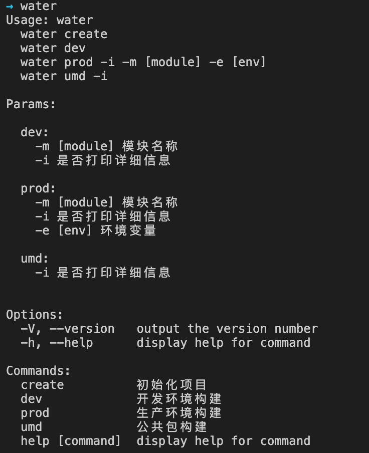

> 近期开源了一个 cli 小工具：
>
> 1. 抽离构建全流程，实现了构建与开发解耦；
> 2. 可以同时支持 vue/react 项目的开发与生产构建（主要因为本人 vue/react 生态用的比较多）；
> 3. 支持项目快速初始化，目前仅引入了 4 个初始化模板，分别为 react/vue 的 js 与 ts 版本，模板将会在后续逐步完成；
> 4. 支持 umd 单独打包公共模块，比如合并 react/react-dom/react-router 为一个通用包这种场景；
>
> 以上是目前场景支持，后续会逐步延展；\
> 下面来分享下开发全流程，大家有兴趣的话也可以做一个自己的 cli 工具，有不对的地方请不吝指正；\
> 烦请各位大佬给个赞，谢谢。

## 初始化

1. `npm init` 初始化 `package.json`

2. `package.json` 中几个重要属性说明
   > `name`：包名，用作之后发布到 `npm` 唯一标识;\
   > `version`：发布包版本号;\
   > `bin`：用来指定各个内部命令对应的可执行文件的位置。

```json
{
  "name": "iwater", // 包名 iwater
  "version": "0.0.1", // 发布版本号 0.0.1
  "description": "基于 react、vue 的 cli 整合工具",
  "keywords": ["webpack", "vue", "react", "cli"],
  "bin": {
    "water": "bin/water", // 主命令 water
    "water-create": "bin/water-create", // 初始化命令 water create
    "water-dev": "bin/water-dev", // 开发环境命令 water dev
    "water-prod": "bin/water-prod", // 生产构建命令 water prod
    "water-umd": "bin/water-umd" // umd 打包命令 water umd
  }
  // ...
}
```

## 编写命令文件

### 目录结构

```bash
.
├── package.json ## 描述文件
└─── bin
    ├── water # 主命令入口
    ├── water-create # 初始化入口
    ├── water-dev # 开发环境入口
    ├── water-prod # 生产环境入口
    └── water-umd # umd 打包入口
```

### `npm link`

> 此命令用作本地调试比较方便，代码即改全局即生效\
> 将命令映射到全局，其实是创建了一个软连接（快捷方式）到全局

### `water` 主入口

```javascript
// 这个声明比较重要，用于声明 linux/unix 系统 shell 脚本查找 node 命令
#!/usr/bin/env node

// commander 用于定义命令声明和接口
const program = require("commander");

program
  // 版本
  .version(require("../package").version)
  // 命令映射
  .usage(
    `
  water create
  water dev
  water prod -i -m [module] -e [env]
  water umd -i`
  )
  // 描述信息
  .description(
    `Params:

  dev:
    -m [module] 模块名称
    -i 是否打印详细信息

  prod:
    -m [module] 模块名称
    -i 是否打印详细信息
    -e [env] 环境变量

  umd:
    -i 是否打印详细信息
    `
  )
  // 命令映射
  .command("create", "初始化项目")
  .command("dev", "开发环境构建")
  .command("prod", "生产环境构建")
  .command("umd", "公共包构建");

// 解析命令参数
program.parse(process.argv);
```

> 这时即可在命令行输入 `water`, 查看命令是否生效



### `water create` 项目模板初始化

```javascript
#!/usr/bin/env node

const { join } = require("path");
// 交互式命令行工具，用作命令选项问答
const { prompt } = require("inquirer");
const chalk = require("chalk");

const { copyFolder } = require("../lib/utils/file");

const developPath = process.cwd();
const waterPath = join(__dirname, "..");
const templatePathPrefix = "template";

// 定义命令行问答
prompt([
  {
    type: "input",
    name: "name",
    message: "项目名称：",
    default: "water-ui",
  },
  {
    type: "list",
    name: "language",
    choices: ["react", "vue"],
    message: "开发语言：",
    default: "react",
  },
  {
    type: "confirm",
    name: "typescript",
    message: "使用 Typescript：",
    default: "Y",
  },
])
  .then(({ name, typescript, language }) => {
    // 问答解析
    const templateName = `${language}${typescript ? "-ts" : ""}`;
    const templatePath = join(waterPath, templatePathPrefix, templateName);
    const toPath = join(developPath, name);

    // 复制项目模板
    copyFolder(templatePath, toPath);
    console.log(chalk.green("> ") + "初始化完成");
  })
  .catch((error) => {
    if (error.isTtyError) {
      console.error("当前环境暂不支持");
      // Prompt couldn't be rendered in the current environment
    } else {
      // Something else when wrong
      console.error(error);
    }
  });
```

### `water dev` 开发模式构建

> 主要思路是抽取 webpack 公共配置，抽离到 cli 命令中统一构建和管理，再以子进程进行调用

```javascript
#!/usr/bin/env node

const program = require("commander");

program
  .usage("[options] -m")
  // 定义参数解析
  .option("-m, --module [module]", "模块名称")
  .parse(process.argv);

const { join } = require("path");
// 子进程
const { spawn } = require("child_process");

// 这里的思路是用子进程调用 webpack-dev-server 去打开开发者模式的构建
// 1. 子进程调用 webpack-dev-server
// 2. webpack-dev-server 调取配置好的配置文件，这里的重点还是 webpack 的配置文件
// 3. 启动监听
const build = spawn(
  "node",
  [
    `${join(
      __dirname,
      "../node_modules/webpack-dev-server/bin/webpack-dev-server.js"
    )}`,
    "--watch",
    "--config",
    `${join(__dirname, `../lib/build/webpack.dev.js`)}`,
    program.module ? ` --env.name ${program.module}` : "",
  ],
  {
    stdio: "inherit",
    shell: true,
    cwd: process.cwd(),
  }
);

build.on("error", (error) => console.error(error));

build.on("exit", (code) => {
  console.log("exit", code);
  process.exitCode = code;
  process.exit();
});
```

### `water prod -i` 生产环境构建

> 主要思路是抽离公共配置文件，直接调用 webpack 去启动构建

```javascript
#!/usr/bin/env node

const { red } = require("chalk");
const program = require("commander");

program
  .usage("[options] -i -m [module] -e [env]")
  .option("-m, --module [module]", "模块名称")
  .option("-i, --info", "是否打印记录")
  .option("-e, --env [env]", "发布环境[dev, uat, prod, front...]")
  .parse(process.argv);

const { getApp, getPackageInfo } = require("../lib/utils/getConfig");
const appConfig = getApp(program.module || null);

if (!appConfig) {
  console.error(red("> 缺少 app 配置"));
  return;
}

const webpack = require("webpack");
const isInfo = program.info;
// 发布环境标识，用作区分不同环境的 bucket
const env = program.env;

webpackConfig = require(`../lib/build/webpack.prod.js`)({
  ...appConfig,
});

const buildStamp = Date.now();

webpack(webpackConfig, async (err, stats) => {
  if (err || stats.hasErrors()) {
    if (err) {
      console.error(red(err.stack || err));
      err.details && console.error(red(err.details));
      return;
    }

    stats.hasErrors() &&
      console.error(stats.toString({ colors: true, chunks: false }));

    console.log("\n> 构建异常 \n");
  } else {
    isInfo && console.warn(stats.toString({ colors: true, chunks: false }));

    console.log(`\n> 构建完成，耗时 ${Date.now() - buildStamp} ms`);
  }
});
```

### `water umd -i` umd 打包入口

> 主要思路是抽离公共配置文件，直接调用 webpack 去启动构建

```javascript
#!/usr/bin/env node

const { red } = require("chalk");
const program = require("commander");

program
  .usage("[options] -i")
  .option("-m, --module [module]", "模块名称")
  .option("-i, --info", "是否打印记录")
  .parse(process.argv);

const { getApp } = require("../lib/utils/getConfig");
const appConfig = getApp(program.module || null);

if (!appConfig) {
  console.error(red("> 缺少 app 配置"));
  return;
}

const webpack = require("webpack");
const isInfo = program.info;

webpackConfig = require(`../lib/build/webpack.umd.js`)({
  ...appConfig,
});

const buildStamp = Date.now();

webpack(webpackConfig, async (err, stats) => {
  if (err || stats.hasErrors()) {
    if (err) {
      console.error(red(err.stack || err));
      err.details && console.error(red(err.details));
      return;
    }

    stats.hasErrors() &&
      console.error(stats.toString({ colors: true, chunks: false }));

    console.log("\n> 构建异常 \n");
  } else {
    isInfo && console.warn(stats.toString({ colors: true, chunks: false }));

    console.log(`\n> 构建完成，耗时 ${Date.now() - buildStamp} ms`);
  }
});
```

## 发布到 npm

1. 首先注册一个 npm 账户
2. `npm login` 用注册的账密进行登录
3. `npm publish` 发布到 npm，每次发布记得修改 `package.json` 版本号
4. 发布成功后即可 `npm i -g iwater` 安装到本地

## 总结

> 以上是 cli 开发的核心流程，`water` 的核心思想：
>
> 1. 整合构建流程到工具，所有项目无需再关注构建；
> 2. 统一 vue/react 项目构建和分发，构建产物统一；
> 3. 拓展 cli 即可达成全局拓展；
>
> 更多细节，请移步[Github](https://github.com/howieyi/water)，给个`star`谢谢\
> 欢迎关注「前端艺匠」公众号，发布大前端领域文章，关注不走丢，谢谢


