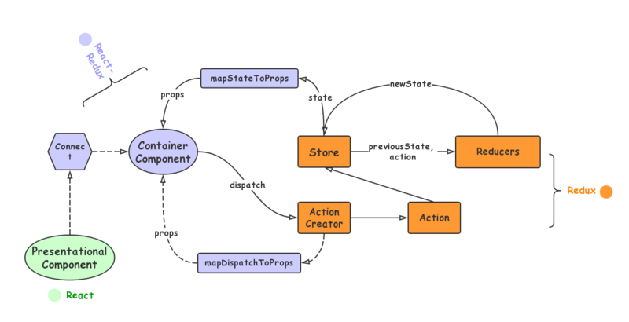
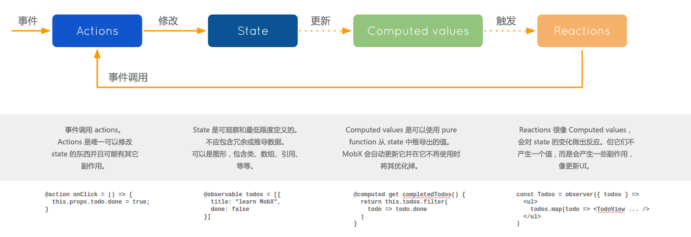

> 本文整理下近期 redux、mobx 在 react 中的使用对比，大家可以根据个人喜好，合理使用 \
> [查看完整 demo](https://github.com/howieyi/redux-vs-mobx)

## redux 状态管理

### redux 基本使用流程

> 首先把 redux 的基本使用步骤梳理一下

1. `createStore` 创建状态集合 `store`，初始化的时候参数是相关的 `reducer` 以及 `middleware`，下面将具体说明

```javascript
import { createStore, combineReducers, applyMiddleware } from "redux";
// 初始化状态集合
const store = createStore(
  // 合并 reducer
  combineReducers({ counter: counterReducer, other: otherReducer }),
  // 引入中间件
  applyMiddleware(logger)
);
```

2. `react-redux` 中的 `Provider` 组件接收创建的 `store`，并置于组件顶层

```javascript
import { render } from "react-dom";
import { Provider } from "react-redux";

render(
  <Provider store={store}>
    <App />
  </Provider>,
  document.getElementById("app")
);
```

3. 定义 `reducer` 自定义行为与处理的 `state`

```javascript
// 初始 state
const INITIAL_STATE = {
  step: 0,
};

// 抽离对外暴露的行为枚举
export const counterActionEnum = {
  step: "step",
  reset: "reset",
};

// 定义 reducer 不同行为下的不同 state 处理
export default function counterReducer(state = INITIAL_STATE, action) {
  console.log("reducer@", state, action, INITIAL_STATE);

  switch (action.type) {
    case counterActionEnum.step:
      return {
        step: state.step + 1,
      };
    case counterActionEnum.reset:
      return {
        ...INITIAL_STATE,
      };
    default:
      return state;
  }
}
```

4. `connect` 链接 `reducer` 参与业务衔接，暴露 `store` 与 `dispatch` 到相关业务组件中

```javascript
import React from "react";
import { connect } from "react-redux";
import { counterActionEnum } from "../reducers/counter";

function Counter(props) {
  const { counter, doStep, doReset } = props;

  return (
    <div>
      <span>计步器：{counter.step}</span>
      <button onClick={() => doStep()}>计步</button>
      <button onClick={() => doReset()}>重置</button>
    </div>
  );
}

// 链接 reducer 与 Counter
export default connect(
  // mapStateToProps 将 state 映射到组件的 props 中
  (state) => ({ counter: state.counter }),
  // mapDispatchToProps 将 dispatch 转发后的 action 映射到组件的 props 中
  (dispatch) => ({
    // 通过 dispatch 触发行为
    doStep: () => dispatch({ type: counterActionEnum.step }),
    doReset: () => dispatch({ type: counterActionEnum.reset }),
  })
)(Counter);
```

### redux 数据流

> 下图可以形象的说明 redux 在数据中的流程表现:
>
> connect -> Component -> dispatch action -> store -> mapStateToProps -> Component update



### 引入 redux 中间件

> 这里思考下 redux 中间件的意义：
>
> 1. 为什么需要有中间件机制？
> 2. 中间件具体在数据流中如何体现？
> 3. 中间件有哪些应用场景？

#### 自定义中间件

> 这里我们先手写一下中间件看看它具体处于数据流的哪一步？

```javascript
// 自定义中间件规则
const logger = ({ dispatch, getState }) => (next) => (action) => {
  console.log("[logger before]:", action);
  // 执行下一个 dispatch
  const result = next(action);
  console.log("[logger after]:", action, getState());
  return result;
};

// ...
// 初始化 store 时引入 logger middleware
const store = createStore(
  // 合并 reducer
  combineReducers({ counter: counterReducer, other: otherReducer }),
  // 引入中间件
  applyMiddleware(logger)
);
```

> 引入中间件后执行一个 action 的打印结果如下：

```javascript
[logger before]: {type: "step"}
// dispatch action
reducer@ {step: 0} {type: "step"} {step: 0}
[logger after]: {type: "step"} {counter: {…}}
```

> 以上打印可以看出 middleware 的可以劫持 `dispatch action` 向下执行，以此可以看出中间件的重大作用，可以穿插于 `action` 数据流走向：
>
> 1. 比如我想在每次 `dispatch action` 前后做些什么；
> 2. 比如我又想劫持某些 `action` 做些什么，这个时候也比较方便；
> 3. 再比如我想实现异步的 `action` 也可以在这一步去做劫持；
>
> 由此可见，`redux middleware` 意义重大

#### redux 异步 action

1. 我们看一下 redux-thunk 的源码，通过劫持 action 来扩展异步

> 其实 redux-thunk 的思路比较简单，劫持了 action function 的扩展

```javascript
function createThunkMiddleware(extraArgument) {
  return ({ dispatch, getState }) => (next) => (action) => {
    // 劫持 action，对 action 提供了扩展，在扩展中自己去实现异步
    if (typeof action === "function") {
      return action(dispatch, getState, extraArgument);
    }

    return next(action);
  };
}

const thunk = createThunkMiddleware();
thunk.withExtraArgument = createThunkMiddleware;

export default thunk;
```

2. 简单来说，其实通过 `mapDispatchToProps` 中自己异步执行 `dispatch` 即可

```javascript
function mapDispatchToProps(dispatch) {
  return {
    // 通过 dispatch 触发行为
    doStep: () => {
      // 1s 后执行 action
      setTimeout(() => {
        dispatch({ type: counterActionEnum.step });
      }, 1000);
    },
    doReset: () => dispatch({ type: counterActionEnum.reset }),
  };
}
```

## mobx 状态管理

### mobx 基本使用流程

1. 创建一个 store

> 定义一个 class，使用注解 `@observable` 使值可响应，使用 `@action` 定义响应方法

```javascript
import { observable, action } from "mobx";

class CounterStore {
  @observable step = 0;

  @action
  doStep = () => {
    this.step++;
  };

  @action
  doReset = () => {
    this.step = 0;
  };
}

// 抛出一个实例
export default new CounterStore();
```

2. `Provider` 引入 `counterStore`

> 所有的 store 都在顶层通过 Provider 混入到全局

```javascript
<Provider counterStore={counterStore}>
  <div>
    <h1>mobx 计步器</h1>
    <CounterApp />
  </div>
</Provider>
```

3. `inject` 将需要的状态混入到组件的 props，并通过 `observer` 使组件可响应

```javascript
// 将 counterStore 混入到 Counter 的 props 中
const CounterApp = inject("counterStore")(observer(Counter));
```

4. 组件中调用对应的 state 与 action

```javascript
function Counter({ counterStore }) {
  const { step, doStep, doReset } = counterStore;

  return (
    <div>
      <span>计步器：{step}</span>
      {"  "}
      <button onClick={() => doStep()}>计步</button>
      {"  "}
      <button onClick={() => doReset()}>重置</button>
    </div>
  );
}
```

### mobx 数据流

> mobx 的思路比较简单，通过 action -> state -> view，下图明确提现了 mobx 的数据交互流程



## 总结

### redux 优点

1. 流程规范，按照官方推荐的规范和结合团队风格打造一套属于自己的流程。
2. 函数式编程，在 `reducer` 中，接受输入，然后输出，不会有副作用发生，幂等性。
3. 可追踪性，很容易追踪产生 BUG 的原因。

### redux 缺点

1. 流畅太繁琐，需要写各种 type、action、reducer，不易上手，初学者可能会觉得比较绕。
2. 同步数据流，异步需要引用其他库（redux-thunk/redux-saga 等）或者通过异步 dispatch 的技巧。

### mobx 优点

1. 容易上手，class 中管理 state、action，使用简单，基于 Proxy 实现的数据响应式。
2. 写更少的代码，完成更多的事。不会跟 redux 一样写非常多的 action、type。
3. 使组件更加颗粒化拆分，并且业务更加容易抽象。

### mobx 缺点

1. 过于自由，mobx 提供的约定及模版代码很少，如果团队不做一些约定，容易导致团队代码风格不统一。

## 往期文章

> 1. [面试让你造轮子，不会就很尴尬了(new/apply/call....)](https://juejin.im/post/5efa1a10f265da23016c5a4b)
> 2. [如何实现一个通过 Promise/A+ 规范的 Promise](https://juejin.im/post/5ecfc732e51d4578801675ee)
> 3. [基于 Proxy 实现简易版 Vue](https://juejin.im/post/5ef74475e51d4534c36d79fa)
> 4. [从源码层面解读 16 道 Vue 常考面试题](https://juejin.im/post/6854573209329598472)
> 5. [32 道面试题详解，看看有你想要的吗？](https://juejin.im/post/6845166890659086344)
> 6. [基于 jsx 语法手写实现简易版 react](https://juejin.im/post/6856751857709252616)
