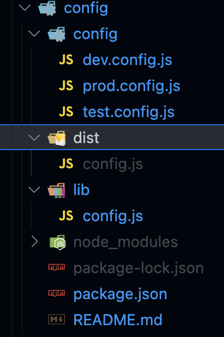
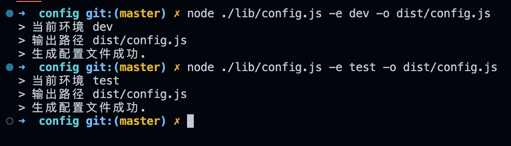

### 吐个槽

> 最近公司其他团队分享了一个生产 bug，生产环境接口域名指向了测试环境，原因居然是*上线忘记改生产配置*这种低级问题，当时有些诧异，为何会出现这种问题？\
> 就这个问题其实是需要反思一下的，*为何上线的时候会忘记更改配置？*或者说这种*手动改代码配置的方式是否可取？* \
> 大多数公司基本上都有不同的运行环境，_DEV_、_TEST_、_PRE_、_PROD_ 等，对于不同环境的维护其实也有很多种处理方式。下面我们针对不同处理方式做一些思考？

### 思考

#### 不同的处理方式

1. 常规的处理方式，通过某种规则判断区分代码环境


```typescript
// 获取环境标识
const env = getCurrentEnv();

if (env === 'dev') {
  // do something
} else if (env === 'test') {
  // do something
} else if (env === 'prod') {
  // do something
}
```

> 分析：\
>
> 1. 此种方式强依赖 **getCurrentEnv** 方法区分环境，这里是*重点*；\
> 2. 强依赖 **if else** 中对于不同环境的处理逻辑；\
>
> 缺点：\
>
> 1. 环境区分*强依赖代码逻辑*，并且各个*环境配置代码均存在于构建产物中*，\
> 2. 环境判断隔离，很难发现其他环境中的问题，代码出错或者改错，不易发现；

2. `process.env.NODE_ENV` 通过 node 运行时环境变量构建时区分代码环境


```typescript
// 获取环境标识
const env = process.env.NODE_ENV;

if (env === 'dev') {
  // do something
} else if (env === 'test') {
  // do something
} else if (env === 'prod') {
  // do something
}
```

> 分析：\
>
> 1. 此情况依赖构建脚本，不同环境增加构建环境变量，以此区分环境 \
> 2. 其他情况*同上一条*
>
> 缺点：\
>
> 1. 需要多定制一次构建脚本，区分不同环境，也可使用 `cross-env` 追加环境脚本；\
> 2. 其他缺点*同上一条*

3. 拆分环境配置代码到不同的配置文件，通过打包方式，固定只获取某个环境配置文件


```typescript
/** 构建运行时环境配置 */
// $ cross-env ENV=test npm run build
// $ cross-env ENV=pre npm run build
// $ cross-env ENV=prod npm run build

// TEST：test.config.js
// PRE：test.config.js
// PROD：prod.config.js

// 这里需要改造打包代码，动态读取对应配置文件到某个全局变量中
const env = process.env.ENV;
// 动态读取对应环境配置文件
const config = require(`./config/${env}.config.js`);

// todo 通过编写构建代码动态添加到全局变量中
```

> 分析：\
>
> 1. 此种情况隔离了不同环境配置，构建产物仅存在当前环境的代码配置，无冗余；\
> 2. 一次编写构建配置，永久生效，仅需要维护不同环境配置文件即可，互不干扰；\
>
> 缺点：\
>
> 1. 需要定制构建代码，动态获取配置到全局变量中，编写成本较高；\
> 2. 不利于运行时环境配置变更，每次改动配置需要重启构建脚本；

4. 拆分环境配置代码到不同的配置文件，通过动态生成各个环境配置文件到本地固定代码文件中，在其他业务代码中固定引用此文件


```typescript
/** 1. 定制脚本动态生成固定配置文件，此处需要定制 config 脚本，*.config.js 为环境配置文件，-s 对应源文件，-o 对应输出文件 */
// $ config -e dev -s ./config/dev.config.js -o src/config.js
// $ config -e test -s ./config/test.config.js -o src/config.js
// $ config -e prod -s ./config/prod.config.js -o src/config.js

// 读取生成的配置文件
import config from './config.js';
```

> 分析：\
>
> 1. 此情况唯一的难点在于*定制脚本动态生成不同的环境配置文件*；\
> 2. 生成的配置文件与其他环境解耦，且纯粹无冗余，并且有良好的运行时支持；
>
> 缺点：\
>
> 1. 定制脚本有些难度

#### 思路小结

> 综上总结，为了解决冗余问题、环境干扰问题、维护变更问题、构建运行时问题等等，我比较推荐第 4 种方式，虽然有些定制难度，不过拆解下实现思路，其实还是有迹可循的：
>
> 1. 定制一个*脚本*入口，可以*读取命令行中定义的入参*；
> 2. *动态读取*配置文件，并*重写配置文件*到固定文件中；
> 3. 应用；
>
> 下面我们就来一步一步实现该思路

### 实现

> 下面让我们来实现此功能


#### 1. 定制脚本入口

> 这里需要完成几个功能点：
>
> 1. 指定入口脚本文件
> 2. 能够解析脚本入参

1. 创建一个 config.js

```typescript
console.log('> config 入口');
console.log('> ', process.argv); // 打印入参
```

2. 解析脚本入参，比如执行 `node ./lib/config.js -e dev -o dist/config.js`

```bash
> node ./lib/config.js -e dev -o dist/config.js

> config 入口
>  [
  '/usr/local/bin/node',
  '/Users/fosunhealth/Documents/ME/learning-tools/packages/config/lib/config.js',
  '-e',
  'dev',
  '-o',
  'dist/config.js'
]
```

> 观察以上打印即可根据出参匹配脚本入参规则，读取到自己想要的参数

- 3. 这里推荐下 `commander` 工具，封装了很多辅助功能，可以偷个懒

```typescript
const program = require('commander');
const { version } = require('../package.json');

program
  .version(version)
  //   .command('config') // 这里用作指定脚本名称，调试阶段可先注释
  .usage('-e <env> -o <output>')
  .description('🍈 生成配置文件')
  .option('-e, --env <env>', '当前环境')
  .option('-o, --output <output>', '输出路径')

  .action(({ output, env }) => {
    console.log('> 当前环境', env);
    console.log('> 输出路径', output);
  });

// 解析脚本入参
program.parse(process.argv);
```

> 此时再执行脚本，得到输出结果如下：
>
> 得到了我们需要指定的环境变量，以及需要输出的路径，这阶段宣告完成

```bash
> node ./lib/config.js -e dev -o dist/config.js

> 当前环境 dev
> 输出路径 dist/config.js
```

#### 2. 动态读取配置文件，并生成到固定文件

> 接上一步，此阶段需要处理入参并动态输出配置文件：
>
> 1. 根据 _env_ **读取**对应配置文件内容
> 2. **写入**到固定文件中



```typescript
// 文件处理工具
const { existsSync, outputFileSync, mkdirSync, writeFileSync } = require('fs-extra');

/** 自定义规则读取本地的配置文件 */
const rootPath = process.cwd(); // 当前上下文根路径，这个很重要，需要基于当前上下文去寻找文件
const configPath = join(rootPath, `./config/${env}.config.js`); // 本地环境配置文件
const outputPath = join(rootPath, output || './src/config.ts'); // 生成配置路径

if (!existsSync(configPath)) {
  throw new Error(`${env} 环境配置文件不存在`);
}

try {
  // 读取配置内容
  const content = readFileSync(configPath, { encoding: 'utf-8' });
  // 写入配置内容
  writeFileSync(outputPath, content, { encoding: 'utf-8' });

  console.log('> 生成配置文件成功.');
} catch (error) {
  console.error('> 生成配置文件异常', error);
}
```

> 如下图执行流程，即可动态生成所需环境配置了
>
> 1. 这样实现具体的配置文件读取规则就可以自定义拉，也能在*业务代码构建过程中动态生成*了
> 2. 使用方式还可以通过*封装到私库中*，通过脚本引用，这样就能当做一个*团队工具*使用了
>
> 源码参考：https://github.com/howieyi/learning-tools/tree/master/packages/config



### 小结

> 本文偏向思路型，主要给大家分享一个公司业务常见的场景，并未展开相关的业务延展性，主要还是需要根据公司独有的业务来定性； \
> 本文均属*个人见解*，如有不对的烦请指出; \
> 如有帮助的，铁子们动动小手，*加个前端技术群*咱们一起*探讨前端技术问题*~~~


